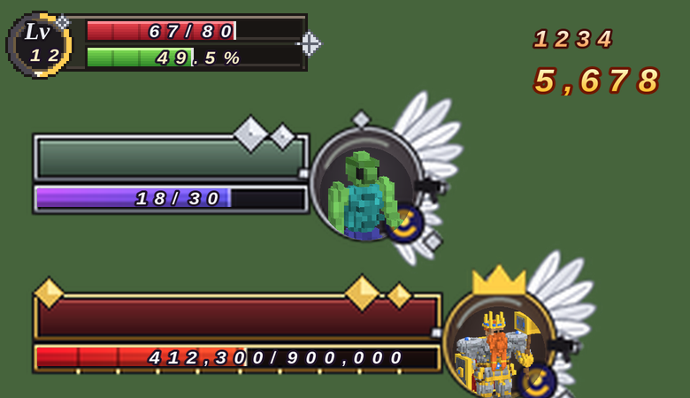
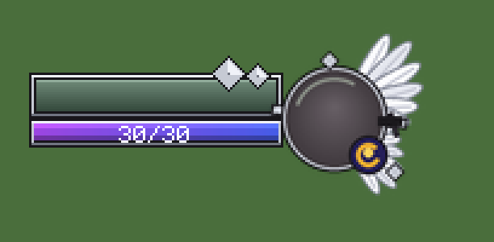
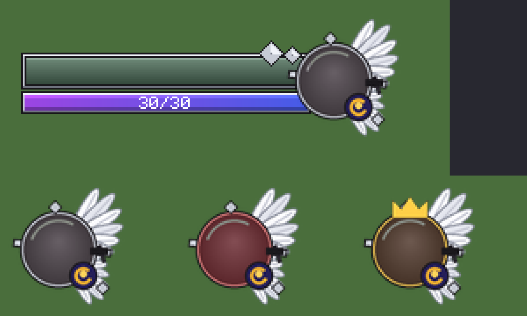
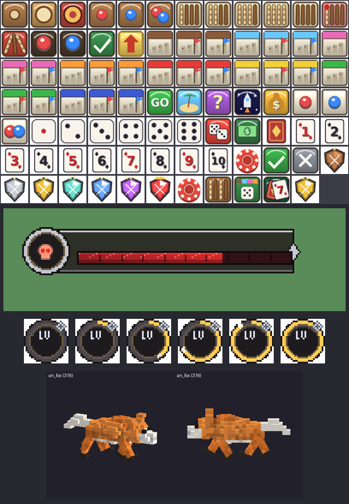
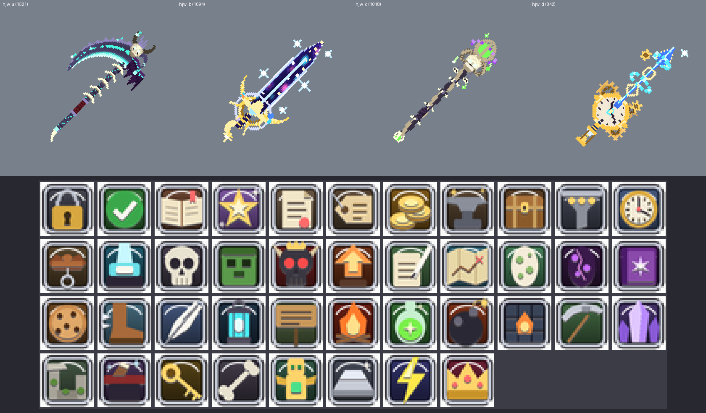

# RpgCraft 패치노트 (v5.1.0 → v5.10.59)

> 서버 버전: Spigot/Paper 1.20.1
> 최신 버전: **v5.10.59** (리소스팩도 v5.10.59 에서 바뀜 — 플러그인과 리소스팩을 둘 다 최신으로 써 주세요)

---

# ✦ v5.10.59 — 별자리 · 영혼석 성장 · 보드게임 2~4명 · 야차 랭킹은 /야차 · 왕성 디테일

## 별자리 특성 트리 (/별자리 · 메인 메뉴)
- **별 조각**을 모아 네 별자리의 별(노드)을 차례로 밝히면 능력치가 영구 적용됩니다.
  - 전사자리: 힘 · 공격력 · 방어력무시 · 치명타 피해
  - 그림자자리: 민첩 · 치명타 · 회피 · 이동속도
  - 방랑자자리: 모험 · 체력 · 방어력 · 경험치
  - 수호자자리 (누구나): 체력 · 방어력 · 체력흡수 · 강화 확률
- 별자리마다 별 12개: 줄기 5개 → 두 갈래 (각 3개) → 두 갈래를 모두 밝히면 **1등성** (가장 큰 효과 · 전체 알림).
- 별 조각 얻는 곳: 레벨 업마다 1 · 보스 처치 3 (근처 48칸에서 함께 싸운 사람 모두) · 5성을 넘긴 영혼석 1.
- 초기화: 300만 원을 내면 쓴 조각을 모두 돌려받음 (쉬프트 + 클릭).
- 설정: `constellation.*` (조각 수 · 비용 배율 · 초기화 비용).

## 몬스터 영혼석 수집 (/영혼석 · 메인 메뉴)
- 몬스터를 잡으면 낮은 확률로 그 몬스터의 **영혼석**을 얻습니다.
  - 일반 0.4% · 정예 · 중간 보스 ×5 · 보스 35% (근처 참여자마다).
- 같은 영혼석을 모으면 별이 오릅니다: 1 · 3 · 7 · 15 · 30개 → 1~5성.
  - 5성을 넘긴 영혼석은 별 조각 1개로 바뀝니다.
- 별마다 계열 능력치가 붙습니다:
  - 언데드: 최대 체력
  - 야수: 치명타 피해
  - 마법: 치명타
  - 인간형: 방어력무시
  - 기타: 방어력
  - 보스: 힘 · 민첩 · 모험
- 계열마다 별 합계가 10 · 25 · 50 이 되면 **세트 효과**가 추가됩니다.
- 창에서 계열을 골라 모은 영혼석과 별, 세트 진행을 볼 수 있습니다. 설정: `souls.*`.

## 보드게임: 2~4명이 함께 (/보드게임)
- 윷놀이 · 부루마블 · 인디언 포커 모두 **2~4명**으로 할 수 있습니다.
  - **컴퓨터와 하기**: 컴퓨터 1~3명을 골라 바로 시작.
  - **방 만들기**: 채팅에 [참가] 버튼이 퍼지고 (`/보드게임 참가 <방번호>`), 방장이 컴퓨터로 빈자리를 채우고 시작.
- 자리 색은 빨강 · 파랑 · 초록 · 노랑입니다 (전용 말 · 땅 · 표지 그림). 창은 사람마다 따로 열려서 "내 말 · 내 카드" 는 자기 자리 기준으로 보입니다.
  - 인디언 포커는 다른 사람 카드는 보이고 **내 카드만 가려집니다**.
- 게임별 규칙:
  - 윷놀이: 다른 사람 말을 잡으면 한 번 더 · 말을 먼저 모두 내보낸 사람이 승리.
  - 부루마블: 파산한 사람은 빠지고 땅은 주인이 없어짐 · 마지막까지 남거나 정해진 바퀴 뒤 재산이 가장 많은 사람이 승리. 황금열쇠 생일 축하금은 모두에게서.
  - 인디언 포커: 아무도 안 걸었으면 체크 · 베팅, 누가 걸면 콜 · 다이 (앞서 체크한 사람에게도 물어봄). 남은 사람 중 가장 큰 수가 판돈을 모두, 공동 1위면 이월. 칩이 0 이면 탈락.
- 창을 닫거나 접속을 끊으면 기권(보상 없음)이고, 그 자리는 컴퓨터가 이어서 둡니다.

## 야차 랭킹은 /야차 로
- `/보드게임` 에 있던 야차 명성 랭킹을 빼고, **`/야차`** 만 입력하면 명성 랭킹 · 등급 칭호 창이 열립니다 (`/야차 <닉네임>` 결투 신청은 그대로).

## 왕성 디테일 강화 (`/rpg관리 kingdom build confirm` 으로 지을 때)
- 모든 첨탑을 계단 비늘 지붕으로 매끈하게.
- 왕성 탑에 첨탑 지붕창 4개 · 꼭대기 깃대와 파란 깃발 · 난간 아래 돌출 까치발.
- 왕성 성벽 바깥에 석영 붙임기둥과 금 첨탑 장식.
- 본궁:
  - 앞으로 튀어나온 정면 누각 (남쪽을 보는 박공 · 장미창 · 창)
  - 기둥 4개 현관 (삼각 박공 · 발코니 난간 · 샹들리에) · 큰 계단 · 붉은 융단
  - 지붕선 버팀벽 위 작은 첨탑

- 리소스팩 · 플러그인 모두 바뀜 (별자리 · 영혼석 메뉴 그림, 보드게임 자리 색 그림).

---

# 🛡️ v5.10.58 — 보스 소환 등 금지 거리도 성 밖 기준 300칸

왕국(`/rpg관리 kingdom build confirm`)을 지은 월드에서는 "스폰에서 300칸" 이던 금지 거리를 모두 **성 밖(왕국 부지 끝)에서 300칸** 으로 셉니다. 성 안은 당연히 모두 금지.
- **보스 소환 아이템** (원혼의 부적 · 발록의 봉인): 성 밖 300칸 안에서는 소환 불가 (`summon.spawn-safe-radius`). 안내 문구도 "성 밖 N칸" 으로.
- **자연 보스** (필드 보스 · 바다 보스 · 월드보스): 성 밖 300칸 안에는 나오지 않음 (`bosses.spawn-safe-radius`).
- **길드 토벌전**: 성 밖 300칸 안에서는 시작 불가.
- **공성 성 짓기** (`castle build`): 성 밖 300칸 안에는 지을 수 없음 (`war.castle-spawn-safe-radius`).
- 왕국을 짓지 않은 서버는 예전처럼 스폰 기준.
- 플러그인만 바뀜.

---

# 🗺️ v5.10.57 — 왕국을 지으면 성 밖부터 Lv.1

- 스폰 왕국(`/rpg관리 kingdom build confirm`)을 지은 월드에서는 몬스터 레벨을 **스폰이 아니라 왕국 부지 끝(성 밖)부터** 셉니다.
  - 성문을 나서 해자 다리를 건너면 바로 **Lv.1** 이고, 성에서 멀어질수록 `mobs.level.blocks-per-level`(기본 40칸)마다 +1 레벨.
  - 네모난 성 둘레를 따라 어느 방향으로 나가도 똑같이 Lv.1 부터 시작합니다 (모서리 쪽도 성벽까지의 거리로 계산).
  - 예전에는 스폰에서 500칸 떨어진 성 밖이 이미 Lv.13 정도였음.
- 필드 보스 · 웨이브 깃발 · 현상금 몬스터 · 던전 입구처럼 위치로 레벨을 정하는 것도 모두 같은 기준을 따릅니다.
- 왕국을 짓지 않은 서버는 예전처럼 스폰에서부터 셉니다. 끄려면 config `kingdom.level-from-wall: false`.
- 플러그인만 바뀜.

---

# 🏰 v5.10.56 — 스폰 왕국 (1000 x 1000) · 스폰 몬스터 금지 · 상점 / 의뢰 NPC 배치

## 왕국 짓기: `/rpg관리 kingdom build confirm`
서 있는 블록을 한가운데(스폰)로 1000 x 1000 부지를 고르고 왕국을 짓습니다 (원래 지형 · 나무는 걷어 내고 평평하게).
설계도는 약 2초 만에 계산하고, 블록 약 400만 개를 틱마다 조금씩 놓아서 서버가 멈추지 않습니다 (`kingdom.ms-per-tick`, `/rpg관리 kingdom status · stop`).

- **중앙 광장 (스폰)**: 3단 대리석 분수 · 동심원 무늬 포석 · 금 장식 오벨리스크 4 · 화단 · 벤치 · 가로등 · 모서리 숲. 월드 스폰은 분수 앞으로 옮겨짐.
- **북쪽 왕성**: 해자와 다리 · 흰 돌 성벽(톱니 난간 · 돌출 장식 · 파란 깃발) · 원형 탑 7개 + 성문 탑 2 · 남쪽 성문루(쇠창살)
  - 본궁: 버팀벽과 큰 아치 창 · 금 띠 · 짙은 슬레이트 박공지붕 · 지붕창 · 모서리 탑 4 · 74칸 대탑 · 첨탑
  - 옥좌의 방: 붉은 융단 · 기둥 · 샹들리에 · 금 옥좌
  - 앞뜰 정원(생울타리 · 장미 · 벚나무 · 분수) · 근위대 막사 · 왕실 회관 · 훈련용 과녁
- **동쪽 시장 거리**: 큰길 양옆 줄무늬 천막 노점 30칸 · 뒤로 2층 상가 · 입구 아치. **상점 NPC 28명**(잡화 · 무기 · 방어구 · 무기고 등 모든 상점)이 노점마다 섬.
- **서쪽 모험가 광장**: 반목조 모험가 길드 회관 · 의뢰 게시판 · **의뢰 NPC 10명**(모든 유형) · 허수아비 · 모닥불.
- **남동 대성당**: 날아 버팀벽 · 스테인드글라스 창 · 장미창 · 쌍둥이 종탑(종) · 회중석 · 제단.
- **남서 원형 투기장**: 계단식 관중석 · 모래 경기장 · 깃발 기둥.
- **북서 호수 공원**: 자연스러운 호수 · 섬 정자 · 아치 다리 · 연꽃 · 꽃 · 나무.
- **북동 대장간 거리**: 화덕(용암) · 굴뚝 · 모루 · 숫돌 · 용광로.
- **주거 구역**: 골목 격자를 따라 반목조 집 수백 채 (층수 · 크기 · 지붕 8종 · 벽 6종 · 뼈대 4종이 저마다 다름, 굴뚝 연기 · 꽃 상자 · 우물 · 텃밭).
- **바깥 성벽**: 두께 6 · 높이 18 · 톱니 난간 · 돌출 장식 · 화살 구멍 · 70칸마다 원형 탑 · 모서리 큰 탑 · 네 방향 쌍둥이 탑 성문루 · 해자와 다리.
- **농장 띠**: 성벽 안쪽 둘레 밀 · 당근 · 감자 · 비트 밭과 물길 · 풍차 6채.
- 그 밖의 의뢰 NPC: 호숫가 어부 · 대장간 광부 · 농장 목동 · 수집가 · 왕성 경비대장.

## 스폰에서는 몬스터가 나오지 않음
- 스폰 둘레 1000 x 1000 (`kingdom.half` 500) 안에서는 몬스터가 자연적으로 생기지 않습니다. 왕국을 짓기 전에도 스폰 기준으로 적용됩니다.
  - 자연 · 스포너 · 습격 · 순찰대 · 웨이브 깃발 · 현상금 몬스터 모두 해당.
  - 관리자 소환이나 허수아비 같은 플러그인 소환은 그대로입니다.
- 무작위로 흩어지는 의뢰 NPC 는 이제 왕국 안에 생기지 않습니다 (왕국 안은 정해진 자리에만).

- 플러그인만 바뀜 (리소스팩은 v5.10.55 그대로).

---

# 🐾 v5.10.55 — 탈것 · 펫 모델 새로 조각

예전 상자를 쌓은 모델 대신, 보스처럼 곡선으로 깎은 3D 복셀 모델로 바꿨습니다.

## 탈것 8종
- **잿빛 늑대**: 풍성한 목 갈기 · 금빛 눈 · 복슬한 꼬리 · 놋쇠 안장과 푸른 안장 천.
- **사막 도마뱀**: 낮고 긴 몸 · 목 프릴 · 주황 등 돌기 · 줄무늬 긴 꼬리 · 붉은 안장 천.
- **기사의 군마**: 강철 투구(이마 뿔 · 붉은 깃털) · 목 · 가슴 마갑 · 금 테 붉은 옆구리 천 · 검은 갈기와 꼬리 · 흰 털신.
- **빙하 곰**: 얼음 갑주 어깨 · 머리 위 얼음 왕관 · 등의 얼음 결정 · 빛나는 푸른 눈 · 서리 발톱.
- **불꽃 사자**: 세 겹 불꽃 갈기 · 불꽃이 타오르는 꼬리 끝 · 발목 불꽃 · 불티.
- **그림자 표범**: 가늘게 빛나는 보랏빛 눈과 흐르는 빛 · 몸의 빛나는 룬 줄무늬 · 그림자 연기.
- **황금 그리핀**: 흰 깃털 목 · 굽은 금빛 부리 · 독수리 앞발 · 금빛 끝의 커다란 날개 · 깃털 술 꼬리.
- **심연의 용**: 긴 목과 뿔 · 이빨 · 머리부터 꼬리까지 이어진 가시 · 보랏빛 막 박쥐 날개 · 빛나는 꼬리 끝.
- 새 모델에 맞춰 탈것마다 안장 높이를 다시 재서, 타는 위치와 크기가 맞게 했습니다.

## 펫 12종 (더 촘촘한 복셀 · 큰 눈 · 귀엽게)
- 왕관 쓴 슬라임 · 리본 병아리 · 당근을 안은 토끼 · 불꽃 꼬리 여우 · 목도리와 털모자 펭귄 · 학사모와 안경을 쓰고 책을 든 부엉이 · 이끼와 버섯이 자란 룬 골렘 · 꽃 화관 요정 · 도깨비불 유령 · 눈 무늬 꼬리 깃 불사조 · 입김 뿜는 아기 용 · 작은 별들이 도는 별의 정령.

- 리소스팩 · 플러그인 모두 바뀜.

---

# 📣 v5.10.54 — /자랑: 손에 든 아이템을 채팅에 자랑

- **/자랑** (= /showoff): 손에 든 아이템을 전체 채팅에 자랑합니다.
  - 채팅의 **아이템 이름에 마우스를 올리면** 이름 · 설명(능력치 · 강화 · 옵션 등 아이템 설명 전부)이 그대로 보입니다.
  - 아이템 이름이나 **[아이템 보기]** 버튼을 누르면 그 아이템을 담은 **보기 창**이 열려 3D 모델과 설명을 직접 확인할 수 있습니다 (꺼낼 수 없음).
  - 자랑한 순간의 모습으로 30분 동안 볼 수 있습니다. 쿨타임 30초 (config `showoff.cooldown-seconds`).
- 플러그인만 바뀜 (리소스팩은 v5.10.53 그대로).

---

# 🐉 v5.10.53 — 사신수 · 사흉수 장비 전용 디자인 · 보스 결투는 능력치 승부 · 활 드는 모습 · 무한의 탑 보상 조정

## 사신수 · 사흉수 장비를 웅장하게
- **기운 조합 창**이 바닐라 네더라이트 검 · 도끼 · 삽 · 가죽 갑옷 그림을 보여 주던 문제 → 이제 **실제 아이템(전용 3D 모델)** 그대로 보여 줌.
- 사신수 무기 4종을 히든 무기처럼 하나씩 손으로 조각한 **전용 3D 모델**로:
  - **청룡검**: 용 머리 가드의 벌린 입에서 뻗어 나온 청옥 대검 · 칼날을 휘감아 오르는 청룡 (금빛 지느러미 · 배) · 녹각 뿔 · 금빛 수염 · 끝에 떠 있는 여의주 · 상서로운 구름.
  - **백호부**: 줄무늬 은빛 자루 · 거대한 초승달 양날 도끼 · 가운데 포효하는 백호 머리 (푸른 눈 · 송곳니 · 이마 王 무늬) · 날에 새긴 빛나는 발톱 자국 · 번개.
  - **주작검**: 물결치는 불꽃 칼날 (흰 심 → 노랑 → 주황 → 빨강) · 날개를 활짝 편 주작 가드 · 폼멜에서 흩날리는 눈 무늬 꼬리 깃 · 불티.
  - **현무창**: 흑옥 자루를 감고 오르는 붉은 눈의 흑사 · 육각 무늬 거북 등딱지 가드 · 물결 가지가 달린 비취 창날 · 청록 술 · 물방울.
  - 강화(+7 · +10) 하면 같은 모양에 더 밝고 화려한 색.
- 사신수 방어구 16종 · 사흉수 갑주 4종에 전용 장식:
  - 청룡: 녹각 뿔 · 용 콧등 · 금 수염 · 가슴을 휘감는 용과 여의주 · 비늘 허리 보호대 · 용 발톱.
  - 백호: 호랑이 얼굴 투구 · 어깨 위 호랑이 머리 둘 · 털 목도리 · 발톱 자국 · 줄무늬 · 짐승 발 신발.
  - 주작: 불꽃 깃 부채 볏 · 등 뒤 불꽃 날개 · 깃털 치마 · 발목 불꽃 깃.
  - 현무: 육각 등딱지 투구와 뱀 · 등 거북 등딱지 · 배딱지 · 등딱지 무릎 · 뱀이 감은 신발.
  - 사흉수: **혼돈**(얼굴 없는 소용돌이 투구 · 네 날개) · **도철**(가슴의 거대한 아가리 · 말린 뿔 무늬) · **도올**(무릎의 멧돼지 엄니 · 갈기) · **궁기**(발목 박쥐 날개 · 발톱).

## 보스끼리 결투는 능력치대로
- 결투 막대기로 붙인 싸움은 이제 공격 속도 · AI 와 상관없이 **능력치로만** 승부: 1초마다 서로 (공격력 × (내 레벨 / 상대 레벨)²) 만큼 피해 → 레벨 · 체력 · 공격력이 높은 쪽이 반드시 이김 (붕붕이가 드래곤을 이기던 문제).
- 이긴 쪽이 약 12초 안에 끝나도록 배율 조정 (config `admin.mob-fight-seconds-to-win`). 싸움 중 서로 때리는 일반 피해는 막음.

## 활을 바르게 듦
- 3인칭에서 활을 가로로 눕혀 들던 문제 → 바닐라 활처럼 세로로 듦.

## 무한의 탑 보상 조정 (조금 줄임)
- 층당 돈 5,500 · 주간 층당 14,000 · 층당 경험치 비율 0.011.
- 주간 순위 보상: 1위 1,000만 + 마스터 큐브 2 · 2위 700만 + 마스터 큐브 1 · 3위 350만 + 마스터 큐브 1 · 4~10위 170만 + 레드 큐브 2.
- 이미 더 높게 설정된 서버는 한 번만 70% 로 낮춤 (직접 낮게 설정한 값은 그대로).

- 리소스팩 · 플러그인 모두 바뀜.

---

# 🩹 v5.10.52 — HUD 체력 · 경험치 바가 어두운 상자에 가려지던 문제

- v5.10.50 에서 HUD 판 · 바 · 배지를 뒤로 밀었는데, 그 **그림자**(글자 그림자 = 글자 모양 그대로의 어두운 복사본)는 앞에 남아 판 그림자가 어두운 상자처럼 바 · 배지를 덮었음.
- 판 · 바 · 배지를 그림자 색이 다른 글자와 겹치지 않는 색으로 그리고, 그 그림자는 셰이더가 숨김 → 바 색이 다시 보이고 판은 아이콘 · 숫자 · 바 아래에.
- 리소스팩 · 플러그인 모두 바뀜.

---

# ⚔️ v5.10.51 — 몬스터 결투 막대기로 붙인 보스끼리도 끝이 나게

- 관리자 결투 막대기로 보스 둘을 싸우게 하면 영원히 끝나지 않던 문제:
  - 보스 체력(수백만)에 비해 보스 공격력이 작아 사실상 죽지 않았음 → 결투 중에는 한 대마다 **상대 최대 체력의 4% 이상** (`admin.mob-fight-hit-pct`, 약 25대면 쓰러짐 · 각성 보스는 한 번 더).
  - 보스 AI 가 0.5초마다 가장 가까운 플레이어로 눈을 돌려 싸움을 멈췄음 → 결투 중엔 플레이어로 바꾸지 않음.
- 플러그인만 바뀜 (리소스팩은 v5.10.50).

---

# 🩹 v5.10.50 — HUD 판이 아이콘 · 숫자를 가리던 문제

- 핫바 오른쪽 판(공격 · 크리 · 방어 · 포션 · 스킬)의 반투명 어두운 판이 아이콘과 숫자 위에 덮여 흐리게 보이던 문제 수정.
  - 원인: 게임이 글꼴 그림을 텍스처별로 묶어 그려, 문자열 순서와 상관없이 판이 나중에 그려질 수 있음.
  - HUD 판 · 체력 / 경험치 바 · 레벨 배지는 약속한 색으로 그리고 셰이더가 뒤로 밀어 항상 아이콘 · 숫자 아래에 깔리게.
- **보스 판 겹침**: 보스가 둘 이상 가까이 있으면 보스 판이 여러 개 겹쳐 보이던 문제 → 플레이어마다 **가장 가까운 보스 판 하나만**.
- **숫자 간격**: 4R 풍 숫자의 왼쪽 여백을 잘라 글자 사이가 벌어져 보이던 것을 좁힘.
- 리소스팩 · 플러그인 모두 바뀜.

---

# 👑 v5.10.49 — 적 정보 글자 수정 · 몬스터 초상 · 보스 전용 판 · 4R 풍 숫자 글꼴

- **적 정보 숫자가 깨지던 문제**: 바 채움 그림이 숫자 위에 덮였음 (게임이 글꼴 그림마다 따로 묶어 그려 순서가 보장되지 않음) → 글자 · 숫자 · 초상은 셰이더가 앞으로 당겨 항상 위에.
- **문장 원 안에 몬스터 생김새**: 모든 몬스터 · 바닐라 몹 · 동물 · 보스의 3D 모델을 3/4 정면에서 그린 초상 120개 (머리 · 가슴을 동그랗게).
- **보스 전용 체력 판 (오른쪽 위)**: 원래 보스바 대신 진홍 이름 칸 + 금 테두리 · 금 마름모, 진홍 → 주황 체력 바 (10마디 눈금 · 바 안 가운데 체력 수치), 금테 · 왕관 문장 안에 보스 초상, 분노 · 광폭화 단계 표시. 보스 판이 보이는 동안엔 일반 적 정보는 숨김. 팩이 없는 사람은 예전 보스바 그대로 (`bosses.panel`).
- **숫자 글꼴을 마크에이지 4R 풍으로**: 3x5 픽셀 숫자 → 굵은 기울임 숫자 + 어두운 테두리 (4배 해상도로 매끈하게)
  - HUD 체력 · 경험치 · 공격력 · 크리 · 방어 · 포션 · 쿨타임 숫자, 레벨 배지 (기울임 세리프 `Lv` + 숫자), 적 정보 체력 숫자 · 레벨 (금빛)
  - **대미지 숫자**: 기본도 흰 → 주황 그라데이션 기울임 숫자, 치명타는 더 크게 노랑 → 금빛 (`combat.damage-4r-font`, 대미지 스킨을 낀 사람은 스킨 그대로)
  - 숫자가 넓어져 HUD 오른쪽 판을 넓힘.
- 리소스팩 · 플러그인 모두 바뀜.

---

# 📐 v5.10.48 — 적 체력바 크기 · 위치를 마크에이지 4R 화면 비율로

- 이름 칸 · 바 폭을 화면의 약 1/6 로 줄임 (164 → 104px), 이름 칸 높이 18 · 바 11.
- 날개 문장은 그대로 크게, 가운데가 이름 칸 · 바 경계에 오도록. 4R 처럼 **문장 오른쪽 절반쯤은 화면 밖으로 잘리게** 오른쪽 끝에 붙임.
- 화면 맨 위에서 조금 내려온 자리 (나침반 아래).
- 리소스팩 · 플러그인 모두 바뀜.

---

# 🪽 v5.10.47 — 적 체력바를 마크에이지 4R 와 똑같은 양식으로

- 오른쪽 위 적 정보를 마크에이지 4R 화면 그대로:
  - 위: 청록빛 회색 그라데이션 **이름 칸** (은 테두리, 가운데 `Lv.12 이름`), 오른쪽 위 모서리 은 마름모 두 개
  - 아래: **보라 → 파랑 그라데이션 체력 바** (은 테두리, 바 안 가운데 흰 `30/30`)
  - 오른쪽: 이름 칸 끝에 겹치는 **하얀 날개 달린 둥근 문장** (뒤로 지나가는 검 · 금빛 용 메달 · 은 마름모). 정예 = 붉은 문장 · 보스 = 금테 + 왕관
- 패널을 조금 아래로 내려 첫 번째 보스바여도 날개가 화면 위로 잘리지 않게.
- 리소스팩 · 플러그인 모두 바뀜.

---

# 🎯 v5.10.46 — 몬스터 이름 · 레벨도 오른쪽 위 대상 정보에

- 머리 위 이름표(레벨 · 이름)를 끄고 **오른쪽 위 대상 정보 하나로** 이름 · 레벨 · 체력 바를 함께 보여 줌 (`mobs.overhead-name: true` 로 머리 위 이름표 다시 켬, 보스는 그대로).
- 싸우는 중이 아니어도 **바라보는 몬스터**(24칸, `mobs.target-hud-look`)의 정보를 오른쪽 위에 띄움. 싸우는 중이면 때리거나 나를 때린 몬스터가 우선.
- 플러그인만 바뀜.

---

# 🎲 v5.10.45 — 피드백 반영 · 보드게임 · 4R 풍 대상 정보 · /명령어

## 플레이어 피드백
- **체력 표시 즉시 반영**: 체력이 바뀌면 다음 틱(0.05초)에 HUD 를 다시 그림 (예전엔 0.5초 주기라 맞고 나서 늦게 깎여 포션 타이밍을 놓쳤음).
- **유적 도전 조건 = 탐험도**: 모험 스탯을 억지로 찍지 않아도 되게. 탐험도 = 걸은 거리 · 몬스터 처치 · 채집 · 낚시 · 도감 발견 · 유적 클리어 · 보물 상자 (항목마다 상한, 최대 420).
  - `ruins.requirement`: `either`(기본: 모험과 탐험도 중 높은 쪽) / `explore`(탐험도만) / `adv`(예전처럼 모험만). 보물 상자 잠금도 같은 규칙.
  - **/숙련** 창 아래에 탐험도와 항목별 점수 표시.
- **히든 패시브 스탯을 스탯 창에 표시**: 스탯 창 힘 · 민첩 · 모험 이름에 "→ 최종" 값, 현재 능력치 책 · 인벤토리 위 능력치 칸에 "히든 패시브 보너스" 목록 (이미 최종 능력치에 포함돼 있던 값을 한눈에).
- **보드게임 (/보드게임 · /오락실)** — 판 수 제한 없이 컴퓨터와 1대1, 이기면 **보드 칩** (미니게임 코인과 따로, 하루 60개까지)
  - **윷놀이**: 윷판(모서리 · 가운데 지름길), 말 2개, 윷 · 모 · 잡기 한 번 더, 업기, 빽도. 컴퓨터는 잡기 · 지름길 · 위험을 따져 둠.
  - **부루마블**: 테두리 26칸, 도시 18곳(6색), 같은 색 독점 ×2 · 호텔 ×3, 월급 · 무인도 · 황금열쇠 · 우주여행 · 사회복지기금, 더블. 파산시키거나 20바퀴 뒤 재산 비교.
  - **인디언 포커 (심리전)**: 상대 카드만 보이고 내 카드는 안 보임. 체크 · 베팅 +1/+3 · 콜 · 다이, 10 들고 다이하면 벌칙. 컴퓨터는 내 베팅 크기로 자기 카드를 짐작하고 가끔 허세.
  - **보드 칩 상점**: 전용 칭호 5종(장착은 상점 · 칭호 메뉴) · 대미지 스킨(사탕 · 맹독) · 장신구 · 펫 간식 (아이템은 거래 가능).
  - 미니게임 광장에도 입구 추가. 전용 그림 83종.
- **야차 명성 (1대1 결투 랭크)**: 이기면 명성 +, 지면 − (Elo, 강한 상대일수록 많이). 같은 상대와는 하루 3판까지만 반영. 등급 브론즈 ~ 마스터 · 그랜드마스터(1위) + 등급 칭호 · 랭킹 (`/야차 랭킹`).

## 요청
- **/명령어**: 쓸 수 있는 모든 명령어를 한글 이름 · 설명과 함께 (클릭하면 채팅창에 입력, `/명령어 <쪽>` · `/명령어 <검색어>`). 관리자 명령어는 관리자에게만.
- **나침반**: 가운데 노란 막대가 왼쪽으로 어긋나 보이던 문제 → 표시마다 정해진 자리에 놓아 오차가 쌓이지 않게, 노란 막대는 없애고 금빛 바늘로.
- **레벨 배지 고리 = 경험치**: 레벨 원 바깥 고리가 12시부터 경험치만큼 금빛으로 차오름 (25단계).
- **몬스터 반격**: 맞고도 가만히 있던 문제 → 때린 플레이어를 바로 노림 (`mobs.retaliate`).
- **4R 풍 대상 정보 (오른쪽 위)**: 머리 위 체력 바 대신, 때리거나 나를 때린 몬스터의 종류 아이콘(일반 · 정예 · 보스) · 레벨 · 이름 · 체력 바 · 체력 수치를 화면 오른쪽 위에 5초 동안. 머리 위엔 레벨 · 이름만 (`mobs.overhead-hp-bar: true` 로 예전처럼). 팩이 없으면 빨간 보스바로.
- **여우 다리**: 걸을 때 다리가 몸 가운데부터 크게 휘둘려 벌어지던 문제 → 엉덩이 관절을 몸 아래로 (늑대도).
- **관리자 몬스터 결투 막대기** (`/rpg관리 싸움막대`): 몬스터 두 마리를 차례로 좌클릭하면 서로 싸움 (쉬프트 좌클릭 취소, 2분 또는 한쪽이 쓰러지면 끝).
- 사이드바의 "(인벤토리 위)" 같은 설명 문구 제거.
- 리소스팩도 바뀜 (보드게임 그림 · 대상 정보 · 경험치 고리 · 셰이더 · 여우).

---

# ⚔️ v5.10.44 — 히든 전용 무기 3D 모델 · 모든 메뉴 아이콘 디자인 · 채집 숙련도 너프

## 히든 직업 전용 무기 (모델이 없어 바닐라 괭이 · 검 · 막대 · 메아리 조각으로 보이던 것)
일반 무기보다 훨씬 크게, 하나씩 직접 조각한 3D 모델 + **손에 들면 무기마다 다른 기운**이 피어오름 (모두에게 보임, `hidden-weapon.aura: false` 로 끔).
- **명계의 낫**: 흑요석 자루(청록 영혼 나선 상감) · 척추뼈 마디 · 뿔 달린 해골 머리 · 거대한 초승달 날 (안쪽 날이 영혼빛, 등은 톱니, 룬 새김) · 찢어진 망토 자락 · 떠다니는 혼불 / 청록 영혼불 기운
- **성운검 스텔라**: 밤하늘을 담은 대검 (성운 소용돌이 · 반짝이는 별) · 빛나는 날 · 황금 천체의 가드 (별빛 살 · 날개 · 기운 궤도 고리와 행성 셋) · 초승달 폼멜 · 떠 있는 별 조각 / 별가루 · 성운빛 기운
- **망자의 홀**: 서로 꼬인 뼈 · 검은 쇠 자루 · 숫양 뿔 해골 (초록 눈빛) · 해골 위 발톱 우리에 갇힌 초록 영혼 구슬 · 떠도는 보랏빛 룬 고리 · 매달린 작은 해골 장식 / 초록 영혼 기운
- **시간의 바늘**: 시계 바늘 모양 레이피어 (속 빈 장식 고리 · 스페이드 끝 · 빛나는 시간의 실) · 시계판 가드 (눈금 · 시침 분침) · 뒤의 톱니바퀴 셋 · 모래시계 폼멜 · 시간의 고리 / 청록 · 금빛 불꽃 기운
- 강화(+7 · +10) 해도 같은 모델, 히든 직업 창의 전용 무기 칸도 이 모델로 보임. 이미 만든 무기도 그대로 바뀜.

## 모든 메뉴의 바닐라 아이콘 → 4R 풍 아이콘 (41종 새로 그림)
도감 · 펫 · 탈것 · 강화 · 거래 · 경매 · 우편 · 숙련 · 탑 · 직업 · 히든 직업 · 군단 · 랭킹 · 길드 · 카지노 · 주식 · 요리 · 잠재 · 한계 돌파 등 모든 창의 단추가 바닐라 아이템 대신 메달 아이콘으로.
- 잠김(회색 염료) → 자물쇠 · 완료/켜짐(연두 염료 · 양털) → 체크 · 닫기/취소(방벽 · 빨간 양털) → X · 화살 → 앞/뒤 화살표(이름 보고 방향)
- 책 · 별 · 쪽지 · 이름표 · 금화 · 모루 · 상자 · 깔때기 · 시계 · 안장 · 신호기 · 해골 · 몬스터 · 보스 · 강화 화살표 · 깃펜 · 지도 · 알 · 용의 알 · 마법서 · 쿠키 · 장화 · 깃털 · 등불 · 표지판 · 불 · 경험치 병 · 폭탄 · 스포너 · 곡괭이 · 수정 · 유적 · 마법 탁자 · 열쇠 · 뼈 · 토템 · 주괴 · 번개 · 왕관
- 무기 · 방어구 · 포션 · 깃발 · 계단 · 물고기 재질은 기존 상점 · 메뉴 아이콘을 씀
- 리소스팩이 없는 사람에게는 종이로 보임 (기존 메뉴 아이콘과 같음)

## 채집 숙련도 너프
- 채집 한 번에 숙련도 경험치 **40 → 8** (거의 캘 때마다 레벨이 오르던 문제). 50레벨까지 약 3,300번 채집. `mastery.gather-exp` 로 조정.

---

# 🔒 v5.10.43 — 히든 직업 다음 단계 효과 비공개

- 히든 직업 창에서 **아직 오르지 않은 단계(다음 단계 포함)의 보너스 · 효과를 ???** 로 가림. 승급해야 밝혀짐.
- 승급 조건 · 좌표 힌트는 그대로 보임. 현재 · 지나온 단계는 그대로 보임.
- 플러그인만 바뀜.

---

# 🏪 v5.10.42 — 상점 아이콘 디자인 · 대미지 스킨 적용 안 되던 문제

- **상점 목록 아이콘 전부 새로 그림** (에메랄드 · 철검 · 철 흉갑 · TNT · 대구 같은 바닐라 아이템 → 상점마다 전용 메달 아이콘)
  - 일반 상점(금화 주머니) · 무기 상점(교차한 검) · 전사/암살자/모험가 방어구(갑옷 + 각 직업 문장) · 방어구 세트 · 특수 상점 · 떠돌이 상인 · 전쟁 물자 · 전당포 · 주문서 · 생선 · 초월 · 요리
  - 무기고 I·II·III: 검 · 단검 · 도끼 · 방패 · 활 · 지팡이 · 창 아이콘, **아이템 개수로 무기고 단계(1·2·3)** 표시 · 특수 무기 상점 전용 아이콘
  - 장신구 · 잠재능력 상점은 메인 메뉴와 같은 아이콘, NPC 에서만 열 수 있는 상점은 회색 아이콘
  - 페이지 · 돌아가기 버튼도 UI 화살표 아이콘으로
- **대미지 스킨이 적용 안 되던 문제 수정**: 리소스팩 "필수" 모드(`resourcepack.required: true`)일 때만 스킨 숫자가 나왔음 → 이제 **리소스팩을 적용한 플레이어에게는 언제나 스킨 숫자**, 팩이 없는 플레이어에게는 기본 숫자를 따로 보여 줌 (`gui-overlay: false` 면 끔).
- 리소스팩도 바뀜 (상점 아이콘). v5.10.41 몽둥이 변경도 이 버전에 포함.

---

# 🪵 v5.10.41 — 몽둥이를 나무 막대기로

- 갈색 몽둥이: 쇠띠 · 쇠 징 박힌 가시 몽둥이 → **투박한 나무 막대기** (살짝 휜 굵은 가지 · 세로로 갈라진 나무껍질 · 옹이 · 잘린 잔가지 · 닳아서 속살이 보이는 끝 · 천을 감고 끈으로 묶은 손잡이).
- 리소스팩만 바뀜.

---

# 🏹 v5.10.40 — 활 드는 방향 90도

- 손에 든 활이 몸 앞을 사선으로 가로지르던 것 → **90도 돌려 세워 들고 시위를 살짝 잡은 것처럼**.
- 리소스팩만 바뀜.

---

# 🦊 v5.10.39 — 여우 뒷다리 수정

- 여우 모델의 뒷다리가 꺾인 발목(허벅지 → 무릎 → 발목) 모양이 작은 몸에서 계단처럼 깨져 보였음 → **곧은 뒷다리 + 몸에 붙은 둥근 허벅지**로. 늑대도 같은 방식으로.
- 리소스팩이 바뀜 (몹 모델).

---

# 💣 v5.10.38 — 크리퍼 폭발 징조 · 물고기 모델 수정

- **크리퍼 폭발 징조**: 3D 모델을 씌운 크리퍼는 바닐라처럼 부풀며 깜빡이는 모습이 안 보였음 →
  - 터지기 시작하면 모델이 **점점 부풀고 하얗게 깜빡임** (터질 때가 가까울수록 빠르게).
  - 머리 위 연기 · 불똥 + 바닥에 **폭발 범위 빨간 원** (곧 터질수록 붉게).
- **황새치 · 무지개 송어가 무기 모양으로 보이던 문제**: 이름(swordfish · rainbow)에 sword · bow 가 들어 있어 무기 모델로 만들어졌음 → 물고기 · 재료 · 음식 등은 무기 모델 대상에서 제외, 원래 물고기 모양으로.
- 리소스팩도 바뀜 (물고기 모델).

---

# 🎁 v5.10.37 — 시즌 패스 보상 칸에 아이템 모델

- 시즌 패스의 보상 칸이 종이 · 염료 같은 바닐라 재질로만 보이던 것 → **실제 아이템(리소스팩 모델 · 개수)** 으로 보임 (받은 칸은 이름 옆에 '받음').
- 레벨 줄: 회색 유리판 대신 **레벨 아이콘** (개수 = 레벨 숫자, 달성하면 밝게 · 아니면 회색).
- 맨 위 패스 정보 · 프리미엄 · 안내 · 이전/다음 · 모두 받기 단추도 4R 풍 아이콘으로.
- 플러그인만 바뀜 (리소스팩은 v5.10.35 그대로).

---

# 🧹 v5.10.36 — 사이드바 줄 앞 아이콘 없앰

- 오른쪽 사이드바의 줄마다 맨 앞에 있던 작은 아이콘을 지움 (글자만 · 은 구분선은 그대로). 힘 · 민첩 · 모험 줄도 글자로.
- 플러그인만 바뀜 (리소스팩은 v5.10.35 그대로).

---

# 💥 v5.10.35 — 대미지 스킨 · 채집 버그 수정 · 펫 등급 합성 5마리

## 대미지 스킨 (메이플스토리 느낌)
- 시즌 패스에서 **대미지 스킨 아이템**을 얻어 **우클릭하면 등록 · 장착**, `/데미지스킨` 에서 가진 스킨으로 언제든 교체.
- 내가 준 대미지 숫자를 **모든 플레이어가 그 스킨으로** 봄 (치명타는 큰 숫자 + 별).
- 스킨 7종 (기본 빨강 포함 8종):
  - 무료 패스: **황금**(15레벨) · **얼음**(35레벨)
  - 프리미엄 패스: **불꽃**(20) · **마력**(30) · **사탕**(40) · **맹독**(45) · **무지개**(50, 마스터 큐브 3개는 49레벨로)
- 리소스팩 필수 모드에서만 스킨이 보임 (팩이 없는 사람에게는 네모로 보이므로 기본 숫자).

## 버그 수정: 가끔 채집이 안 되던 나무 · 돌
- 채집 블록 목록에 없던 **화강암 · 섬록암 · 안산암 · 조약돌 · 응회암 · 방해석 · 구리/석탄/청금석/레드스톤 광석 · 나무껍질 블록 · 벗긴 원목 · 진홍/뒤틀린 줄기** 등이 채집되지 않았음 → 이름으로 판별해 모두 채집 (서버의 예전 config.yml 에 목록이 남아 있어도 적용).
- 다른 보호 처리가 먼저 막으면 채집이 무시되던 문제 → 채집을 가장 먼저 처리.
- ※ 월드 스폰 근처는 바닐라 **스폰 보호**(server.properties 의 `spawn-protection`, 기본 16칸) 때문에 OP가 아닌 플레이어는 아예 블록을 캘 수 없어 채집도 안 됨 → `spawn-protection=0` 으로 바꾸면 해결 (야생 방지는 플러그인이 따로 함).

## 펫
- **등급 합성**: 같은 등급의 남는 펫 3마리 → **5마리** (`pets.fuse-count`).

---

# 🎨 v5.10.34 — 4R 풍 인벤토리 스탯 · 메뉴 아이콘 · 바닐라 몹 모델 · 밸런스

## 무기 모델
- **활**: 바닐라 활과 같은 방향 · 같은 손 위치로 (거꾸로 들던 문제 수정). 휜 쪽이 쏘는 쪽.
- **방패**: 아이템처럼 앞에 들던 것 → **바닐라 방패처럼 몸 옆에** 들고 **실제 방패 크기**(약 1.4배)로. 막을 때(우클릭)는 바닐라처럼 앞으로 들어 올림.
- **갈색 몽둥이**: 나뭇결 · 옹이 · 깎인 자국 · 쇠띠 두 줄 + 리벳 · 박힌 쇠 징 18개 · 가죽 손잡이 · 쇠 폼멜 · 손목끈.

## 스탯을 인벤토리 위로 (마크에이지 4R 처럼)
- 인벤토리(E) 위 **2x2 제작 칸 자리에 스탯**: 힘 · 민첩 · 모험 문장 + 어빌리티 포인트, 결과 칸 = 능력치 요약 (클릭하면 자세한 스탯 창).
- 좌클릭 +1 · 우클릭 +10 · 쉬프트 전부. (그 대신 인벤토리 2x2 제작은 쓸 수 없음 — 제작대는 그대로)
- 메인 메뉴의 스탯 자리에는 **시즌 패스**.

## UI 디자인
- **메인 메뉴 아이콘 전부 새로**: 기능마다 은 테두리 메달 아이콘 (시즌 패스 · 특수 스킬 · 강화 · 룬 · 포션가방 · 기운 · 대장장이 · 의뢰 · 상점 · 워프 · 길드 · 잠재능력 · 랭킹 · 도감 · 업적 · 출석 · 장신구 · 룰렛 · 설정 · 직업/히든 직업 · 도움말 · 무한의 탑 · 숙련도).
- 설정 창 아이콘도 설정마다 (꺼지면 회색), 메인 메뉴로 · 닫기 단추도 새 아이콘.
- **히든 전직서**: 계열(망령 · 별 · 네크로맨서 · 시간술사) · 단계(1 나무 · 2 은 · 3 금 + 오라)마다 다른 그림.
- **오른쪽 사이드바**: 줄마다 작은 아이콘 + 은 마름모 구분선 (직업 · 레벨 · 소지금 · 포인트 / 힘 · 민첩 · 모험 · 전투력 · 의뢰 · 길드 / 버프).
- **위쪽 나침반**: 은 테두리 띠 · 양끝 마름모 · 가운데 금빛 바늘.
- **플레이어 정보창 (쉬프트 + 우클릭)**: 왼쪽 장비 칸 + 실루엣, 오른쪽 공격 · 치명 · 생존 문장 · 직업 · 전투력 · 전체 능력치, 장신구 · 룬 칸, 칭호 · 길드.

## 바닐라 몬스터 · 야생 동물 모델 (아머러스 워크샵 느낌)
- 좀비 · 허스크 · 드라운드 · 스켈레톤 · 스트레이 · 위더 스켈레톤 · 크리퍼 · 거미 · 동굴 거미 · 엔더맨 · 마녀 · 약탈자 · 변명자 · 슬라임 · 마그마 큐브 · 팬텀,
  소 · 돼지 · 양 · 닭 · 토끼 · 늑대 · 여우 · 염소 · 북극곰 — 블록을 쌓은 3D 모델로 (걷기 · 머리 돌리기 · 공격 · 피격 움직임).
- 렉 방지: 플레이어 40블록 안의 몹에만 붙이고 멀어지면 뗌 (`mob-models.vanilla-range`). 길들인 동물 · 소환수 · 탈것은 그대로. 종류별 끄기 가능 (`mob-models.vanilla-types`).

## 밸런스
- **흡혈 -15%** (모든 흡혈량 × 0.85, `player.lifesteal-mult`).
- **숙련도 경험치 × 0.6** (덜 오름).
- **무한의 탑 돈 보상 너프**: 처음 오른 층 1.5만 → 8천 × 층, 주간 최고 층 4만 → 2만 × 층, 순위 보상 돈 절반.
- **시즌 패스 돈 보상 없음**: 돈 칸은 모두 아이템(포션 · 결정 · 경험치 주문서 · 잠재 주문서 …)으로.
- **일반 몬스터 경험치 75%** (정예 · 중간 보스 · 보스는 그대로, `mobs.normal-exp-mult`).

## 버그 수정
- **설정이 자꾸 꺼지던 문제** (획득 경험치 채팅 등): 메뉴를 빠르게 두 번 누르면 더블클릭이 한 번 더 들어와 켰다가 바로 꺼졌음 → 더블클릭 무시 + 설정 전환 0.3초 연타 방지.

---

# 🛡️ v5.10.33 — 화면 HUD도 마크에이지 4R 풍으로

- **핫바 왼쪽**: 둥근 **LV 배지** (은 고리 · 마름모 장식, 안에 레벨 숫자) + **체력 바**(빨강, 현재/최대) · **경험치 바**(초록, %) 를 은 테두리 판에 묶음.
- **핫바 오른쪽**: 같은 판에 ⚔ 공격력 · ✦ 크리티컬 · (퀵 스킬) / 🛡 방어 · 🧪 포션 개수 · ⚡ 강공격 쿨타임.
- 예전처럼 핫바 위에 떠 있던 체력 줄 · 수치 줄과 **바닐라 경험치 바 · 초록 레벨 숫자는 숨김** (레벨 · 경험치는 왼쪽 HUD에).
- 핫바는 v5.10.32 의 4R 풍(양 끝 마름모 · 은빛 선택 칸) 그대로.
- 설정에서 HUD를 끄거나 리소스팩이 없으면 예전처럼 액션바 글자 HUD.

---

# 🪽 v5.10.32 — UI 디자인을 마크에이지 4R 풍으로

- **모든 창** (메뉴 · 상점 · 스탯 · 미니게임 · 강화 …) 의 배경을 4R 풍으로 다시 그림.
  - 어두운 회갈색 판 + 3겹 은청동 테두리 + 모서리 리벳.
  - 칸은 판보다 어둡게 파인 사각 칸 (칸 사이에 틈).
  - 아래 가방 칸도 같은 판으로 (예전 양피지색 → 통일), 위아래 사이 마름모 구분선.
- **창 위 머리 장식**: 양 끝에 은빛 마름모가 달린 제목 띠 + **날개 달린 검 문장**이 모든 창 위에 뜸.
- **바닐라 화면도 같은 디자인**: 핫바(양 끝 마름모 · 은빛 선택 칸), 인벤토리(E) 창, 상자 창.
- 어두운 판에서 안 보이던 회색 '인벤토리' · '제작' 글자는 숨김.
- 리소스팩만 바뀌는 것이 아니라 플러그인도 머리 장식을 붙이도록 바뀌었으니 **둘 다 업데이트**해 주세요.

---

# 🎮 v5.10.31 — 미니게임 4종 추가 (총 8종)

`/미니게임` 광장에 새 게임 4개 (게임마다 전용 그림 · 배경 · 효과음, 난이도 3단계, 성공 보상 미니게임 코인 1 / 3 / 6).

- 🐍 **뱀 게임**: 9×5 풀밭에서 사과를 먹고 길어지기. 맨 아래 ◀ ▲ ▼ ▶ 또는 **풀밭을 클릭하면 그쪽으로 꺾음**.
  - 황금 사과 +2 (잠깐만 나타남). 쉬움 · 보통은 벽을 넘으면 반대편으로, 어려움은 벽 · 바위에 부딪히면 끝.
  - 목표: 사과 10 / 15 / 18개.
- 🎵 **리듬 게임**: 네 줄에서 음표가 내려오고, 판정선에 닿는 순간 그 줄을 클릭 → **맞춘 음이 소리 나서 실제로 노래가 연주됨**.
  - 쉬움 「반짝반짝 작은 별」 · 보통 「환희의 송가」 · 어려움 「학교 종」 + 「작은 별」 빠르게.
  - PERFECT / GOOD / MISS 판정 · 콤보 (10콤보부터 소리가 화려해짐). 정확도 65 / 75 / 80% 이상이면 성공.
- 🔢 **2048**: 4×4 판의 숫자를 ▲ ◀ ▶ ▼ 로 밀어 같은 숫자끼리 합치기. 목표 128 / 256 / 512 타일 (어려움은 4가 자주 나오고 제한 6분). 더 밀 수 없으면 실패.
- 🐤 **날아라 새**: 아무 칸이나 클릭하면 날아오르고 가만히 있으면 떨어짐. 기둥 사이 틈을 8 / 12 / 16개 통과하면 성공.
- 미니게임 광장을 8종에 맞게 다시 꾸밈 (게임마다 색 테두리, 새 게임에 NEW 표시, 보상은 게임 설명에).
- 하루 판 수는 그대로 (모든 게임 합쳐 5판, config `minigames.daily-plays`). 보상은 `minigames.reward.snake / rhythm / g2048 / flappy`.

---

# 🗼 v5.10.30 — 무한의 탑 · 숙련도 · 펫 성장

## 무한의 탑 (`/탑`, 메뉴)
- 혼자 도전하는 **끝없는 층 오르기**. 하늘 위 개인 전투장에서 층의 몬스터를 모두 쓰러뜨리면 다음 층.
  - 층마다 제한 시간 120초 · 층을 넘으면 체력 30% 회복.
  - **5층마다 정예 층**, **10층마다 보스 층** (마녀 → 드워프 왕 → … → 태초의 용, 100층부터는 정예 보스 호위 추가).
  - 1층 몬스터 Lv.11, 층마다 +3 레벨 · 수도 늘어남.
  - **10층마다 체크포인트**: 다음 도전은 마지막으로 넘은 10층 다음부터 시작 가능.
  - 죽거나 · 시간이 끝나거나 · 전투장을 벗어나면 도전 끝 (원래 있던 곳으로). `/탑 나가기` 로 그만두기.
  - 하루 도전 10회 (config `tower.daily-entries`).
- 보상
  - 층을 넘을 때마다 경험치 · 시즌 패스 경험치.
  - **처음 오른 층**마다 돈 (층 × 1.5만, 10층마다 3배 + 결정 · 룬 · 주문서).
  - **주간 순위** (월요일 마감, 우편): 1위 3천만 + 마스터 큐브 3 · 2위 2천만 + 2 · 3위 1천만 + 1 · 4~10위 5백만 + 레드 큐브 3, 모두 최고 층 × 4만.
- 탑 안에서는 탈것 · 순간이동 요청 · 결투 불가, 전투장 블록은 부술 수 없음.

## 숙련도 (`/숙련`, 메뉴) — 각각 최대 50레벨
- **생활 숙련**
  - 채집: 하나 더 얻을 확률 +1%/Lv · 25/50레벨에 희귀 재료 확률 ↑ · 쿨타임 -0.6%/Lv.
  - 낚시: 희귀 어종 확률 +1%/Lv · 물고기 크기 ↑.
  - 요리: 두 개 만들 확률 +0.4%/Lv · 음식 지속 시간 +1%/Lv.
  - 대장장이: 최저 품질 75% → 최대 90%.
- **전투 숙련** (검 · 단검 · 도끼 · 방패 · 창 · 몽둥이 · 활 · 지팡이 따로): 그 무기를 들고 처치하면 오르고, 그 무기를 들면 **주는 피해 +0.4%/Lv (50레벨 +20%)**.
- **직업 숙련** (직업마다 따로, 히든 직업 포함): 지금 직업으로 처치하면 오름.
  - 전사 힘 · 체력 / 궁수 민첩 · 치명타 / 도적 치명타 피해 · 회피 / 수호자 모험 · 방어력 / 마법사 마력 · 체력 / 히든 힘 · 민첩 · 모험 · 체력.
- 처치 경험치: 일반 2 · 커스텀 3 · 정예 6 · 중간 보스 15 · 보스 60.

## 펫 성장 · 진화 · 합성 (`/펫` → 펫 **우클릭**)
- **레벨**: 꺼내 둔 펫이 사냥으로 경험치를 얻음 (일반 1 · 정예 4 · 중간 보스 10 · 보스 40). 레벨마다 능력치 +3%.
- **먹이**: 펫 간식(+60, 요리 재료 상점에서 판매) · 요리 음식(+40).
- **진화**: 아기(최대 Lv.10) → 성장(Lv.20, 능력치 ×1.35) → **각성**(Lv.30, ×1.8). 진화할수록 펫이 커지고, 각성하면 반짝임.
- **별 합성**: 중복으로 뽑은 같은 펫은 이제 환급 대신 **합성 재료로 보관** → 같은 펫 1마리로 별 +1 (별마다 능력치 +8%, 최대 ★5).
- **등급 합성**: 같은 등급의 남는 펫 3마리 → 한 등급 위 펫 알 1개 (일반 → 희귀 → 영웅 → 전설).
- 별이 가득 차고 남는 펫도 3마리 이상이면 그때부터 중복은 예전처럼 환급.

---

# ⛑️ v5.10.29 — 투구 디자인 다시 만들기

- 둥근 머리처럼 보이던 투구를 **진짜 투구 모양**으로 다시 조각함 (얼굴 속 빛나는 눈 없앰).
  - **금속 투구**: 각진 옆면 + 둥근 정수리 + 뒤로 벌어진 목 가리개 · 이마 띠 · 정수리 능선 · 리벳.
    - 판금 세트(상위 전사 · 기사 · 드워프 · 초월 1·5단계): **T자 얼굴 틈** + 코 가리개.
    - 나머지: 볼 가리개가 있는 열린 얼굴.
  - **두건(암살자 · 비전)**: 뒤로 뾰족하게 늘어진 두건 끝 · 어깨 망토 · 얼굴 아래를 가린 복면.
  - **모험가**: 가죽 비행 모자 (귀덮개 · 앞 챙, 고글 세트는 이마에 고글).
  - 볏 · 뿔 · 귀 · 날개 · 왕관 같은 장식은 그대로.

---

# 🛡️ v5.10.28 — 방어구도 블록을 쌓은 3D 모델로

- 모든 방어구(직업 방어구 · 세트 · 사신수 · 흉수 등 132종)를 무기처럼 **블록을 쌓아 만든 3D 아이템 모델**로 바꿈.
  - **투구**: 세트마다 다른 장식 — 마법사 모자 · 두건 · 바이저 · 볏 · 날개 · 고글 · 왕관 · 지느러미 · 뿔 · 귀 · 깃털.
  - **갑옷**: 몸통 + 도드라진 흉갑과 보석 · 허리띠 · 2단 견갑 (천 세트는 망토).
  - **바지 · 신발**: 무릎 보호대 · 밑창까지 입체로.
  - 세트의 몸 색 · 테두리 색 · 보석 색 · 무늬를 그대로 살림.
- 가방 · 손에 들었을 때 · 바닥에 떨어졌을 때 모두 3D로 보임.
- ※ 입었을 때 몸에 보이는 모습은 1.20.1 의 한계로 기존 방어구 텍스처 그대로입니다.

---

# 🐉 v5.10.27 — 무기마다 속성 테마 장식 (마크에이지 4R 느낌)

- 무기마다 **속성 테마**를 정해 서로 다른 장식을 붙임 (칼날 속은 어둡게 · 거친 결):
  - **심연** (마녀 · 렉스의 명작 · 보라색 고급 무기): 칼등을 따라 돋은 가시 · 옆으로 휜 갈고리 날 · 가드의 **붉은 눈**.
  - **자연** (현무 · 펜더 · 초록색): 칼날을 감은 덩굴 · 잎 · 가드와 끝의 교차한 가지.
  - **서리** (바다 · 하피 · 파란색): 가드에서 휘감아 오르는 영혼 기운 · 끝의 얼음 결정.
  - **화염** (붕붕이 · 주작 · 빨간색): 가드 양쪽의 작은 불꽃 (칼날은 깔끔하게).
  - **용** (청룡 · 드워프): 한쪽으로 펼친 **막 날개** · 빛나는 눈 · 폼멜의 뿔.
  - **신성** (초월 · 백호 · 노란색): 칼날 받침의 빛 고리 · 끝의 별.
- 기본 무기와 낮은 등급(무기고 · 대장장이 1~2등급)은 깔끔한 칼날 그대로.
- 블록 크기 0.32 → 0.38 (장식이 늘어난 만큼 무게 조절).

---

# 💎 v5.10.26 — 무기 블록을 더 촘촘하게

- 무기 3D 모델의 블록 크기를 0.5 → 0.32 로 줄여 **블록이 약 2.5배** — 곡선 · 칼날 끝 · 가드 · 손잡이 감은 끈 · 보석이 더 매끄럽고 정교함.
- 무기 하나에 블록 요소 약 400~900개 (리소스팩 10.4MB).

---

# 🗡 v5.10.25 — 무기를 깔끔하게

- 불꽃 · 가시 칼날과 가드 불꽃, 떠 있는 결정 조각을 모두 없애고 **깔끔한 칼날**로 통일.
- 남은 장식: 끝으로 갈수록 은은하게 밝아지는 칼날 · 홈의 룬 · 날개 가드 · 보석 · 감은 손잡이 (무기마다 가드 · 칼날 · 폼멜 모양은 다름).

---

# ⚔ v5.10.24 — 무기 모양 정리 (특별한 무기만 불꽃)

- 모든 무기가 불꽃 칼날이라 단조롭던 것 → **특별한 무기만** 불꽃 · 가시 칼날:
  - 사신수 · 렉스의 명작(유물) · 붕붕이 무기, 초월 · 대장장이 5등급, 무기고 7~8등급.
  - 가드 불꽃 조각은 그중에서도 사신수 · 유물 · 붕붕이 · 무기고 8등급만.
- 나머지 무기는 깔끔한 칼날 (빛나는 그라데이션 · 룬 · 날개 가드 · 떠 있는 결정)로 무기마다 모양이 다름.

---

# 🔥 v5.10.23 — 불꽃 · 가시 칼날 무기

- 보내 준 참고 이미지 느낌으로 무기 모양 변경:
  - **들쭉날쭉한 불꽃 · 가시 칼날**: 한쪽이 크게 갈라진 가시가 위로 뻗는 비대칭 실루엣, 길고 뾰족한 끝.
  - **어두운 속살 → 빛나는 가장자리**, 칼날 속을 흐르는 **빛줄기**.
  - 가드에서 피어오르는 **불꽃 조각** (가운데 하얗고 끝은 어둡게), 높은 등급은 폼멜 아래 불꽃 꼬리.
  - 검 · 단검 · 창(2등급 이상)에 적용, 가장 낮은 등급 무기는 매끈한 칼날 그대로.
  - **활**: 마디진 덩굴 같은 휜 몸 · 잎 · 가는 시위.

---

# ✨ v5.10.22 — 무기를 화려한 MMORPG 느낌으로

- 3D 무기를 더 크고 화려하게 (판타지 RPG 느낌):
  - 칼날 · 도끼날이 **끝으로 갈수록 빛나는 그라데이션**, 홈에는 **빛나는 룬 문양**.
  - 검 · 단검: 가드 위로 뻗는 **겹겹의 날개 장식**, 칼날 받침(리카소)과 큰 보석, 칼날 옆에 **떠 있는 결정 조각**.
  - 지팡이: 둥근 구슬 대신 **길쭉한 마력 결정** + 주위를 떠도는 결정 조각. 높은 등급 창도 결정 조각.
  - 검 · 단검 · 도끼 머리를 조금 더 크게.

---

# 🗡 v5.10.21 — 모든 무기 3D 복셀 모델 (아머러스 워크샵 방식)

- **모든 무기(약 230종 + 강화 +7 · +10 변형)를 블록을 쌓아 깎은 입체 모델로 새로 만듦**. 예전에는 픽셀 그림에 두께만 준 납작한 모양이었음.
  - **검**: 마름모 단면 칼날 (가운데 능선 · 밝은 날 · 상감 홈), 입체 가드 (곧은 / 위로 젖혀진 / 초승달 / 가시 4가지), 끈을 감은 둥근 손잡이 · 쇠고리, 폼멜 (보주 / 마름모 / 고리) · 보석.
  - **단검**: 짧고 휜 칼날 · 작은 가드. **도끼**: 부채꼴 날 (한쪽 날 + 뒤 가시 / 양날) · 머리를 감싼 쇠 · 위 가시. **망치 · 몽둥이**: 큰 머리 · 징 · 가시.
  - **창**: 잎 모양 날 · 날 받침 · 갈고리 날개 · 술. **지팡이**: 큰 보주 + 감싸는 발톱 / 이중 고리 / 초승달 날개. **활**: 휜 몸 · 감은 손잡이 · 시위. **방패**: 볼록한 판 · 두꺼운 테 · 십자 문장 · 가운데 돌기 · 징.
  - 색은 원래 무기 그림에서 칼날 · 날 · 가드 · 손잡이 · 보석 · 상감 색을 뽑아 써서 무기마다 원래 느낌 유지, 모양(가드 · 칼날 · 폼멜)은 무기마다 다르게.
  - 강화 +7 · +10 은 같은 모양에 더 밝고 화려한 색.
  - 손에 드는 위치는 예전과 같음 (손잡이 왼쪽 아래 → 끝 오른쪽 위).
- 리소스팩 크기는 오히려 조금 줄어듦 (3D 요소 17만 → 14만).

---

# 🎁 v5.10.20 — 성 소유 혜택 · 시즌 패스 · 길드 스킬 · 우편함 · 요리 · 히든 전용 무기

## 🏰 성 소유 혜택
- 성을 가진 길드는 **매일 성 수입** (성 하나당 300만원 → 길드 금고) + 길드 경험치 500.
- 길드원 버프 (성 하나당, 최대 2개까지 겹침): 힘 · 민첩 · 모험 +5% · 체력 +5% · 경험치 +10%.
- 공성전 승리 시 길드 경험치 2000 · 시즌 패스 경험치 300.
- 설정 `war.castle-daily-income` · `war.castle-buff.*` · `war.castle-buff-max-stack`.

## ✦ 시즌 패스 (`/시즌패스`, `/패스`)
- 회차가 바뀌면 새 시즌. 1~50레벨, 레벨마다 **무료 보상**(돈 · 상급 결정 · 파괴 방지권 · 중급룬) + **프리미엄 보상**(잠재능력 주문서 · 수상한 큐브 · 강화 확률권 · 명장의 큐브).
- 패스 경험치: 사냥 1 · 커스텀 몬스터 2 · 보스 100 · 낚시 3 · 미니게임 15 · 요리 5 · 공성전 승리 300 (150마다 1레벨).
- 프리미엄은 3,000만원 (시즌마다, 지난 레벨 보상도 모두 받을 수 있음). "모두 받기" 버튼. 가방이 가득 차면 우편으로.

## 🛡 길드 레벨 · 길드 스킬 (`/길드 스킬`)
- 길드원이 사냥(1 · 커스텀 2 · 보스 100) · 공성전 · 성 수입으로 **길드 경험치**를 모음. `/길드 레벨업`은 이제 경험치(3000 × 레벨²)도 필요. 최대 레벨 5 → 10.
- 레벨마다 스킬 포인트 2. 스킬 5종 × 5단계: 전투 교리(힘·민첩·모험 +1.5%) · 강인함(체력 +2%) · 수련(경험치 +3%) · 행운(치명타 +1%) · 견고한 성벽(우리 성 성벽 피해 -6%). 길드장이 배우고, 금고 1,000만원으로 초기화.

## ✉ 우편함 (`/우편`)
- 접속하지 않은 사람에게도 돈 · 손에 든 아이템을 보냄: `/우편 보내기 <플레이어> [금액] [메시지]` (수수료 1,000원).
- 받은 우편은 클릭하거나 "모두 받기"로 받음. 30일 지나면 사라짐. 접속할 때 안 받은 우편 알림.
- 관리자: `/rpg관리 mail <플레이어|all> <money|아이템ID> <수량> [메시지]`.

## 🍳 요리 (`/요리`)
- 음식 7종: 든든한 스튜(체력 +10%) · 불꽃 고기 꼬치(힘·민첩·모험 +6%) · 생선 구이 정식(치명타 +5% · 치명타 피해 +20%) · 숲의 버섯 수프(방어 +6) · 꿀 케이크(경험치 +15%) · 사냥꾼 도시락(이동 속도 · 회피) · **왕의 만찬**(전부 +10%, 30분).
- 재료: 요리 재료 상점(`/상점 cook`, `/요리`에서 바로 열기) · 낚시로 잡은 물고기 · 마력 핵. 일반 마인크래프트 재료(감자 · 소고기 등)도 됨.
- 음식을 들고 우클릭하면 먹음 (버프는 하나만, 15분). 50번 요리할 때마다 두 개 만들어질 확률 +5% (최대 25%).

## ⚔ 히든 직업 전용 무기 (히든 직업창에서 제작)
- 마력 핵 20 · 상급 결정 10 · 3,000만원. 그 히든 직업만 쓸 수 있고 단계가 오를수록 효과가 강해짐.
  - 망령의 길 **명계의 낫**: 15% 확률 영혼 베기 (추가 피해 + 체력 회복).
  - 별의 길 **성운검 스텔라**: 치명타 때 25% 확률 별빛 일격 (주변까지).
  - 죽음의 길 **망자의 홀**: 들고 있으면 군단원 공격력 +15%/단계, 공격 시 군단 회복.
  - 시간의 길 **시간의 바늘**: 공격할 때마다 되감기 대기 -0.25초/단계.

---

# 🧭 v5.10.19

- **히든 직업창에 다음 단계 NPC 좌표 힌트**: 다음 단계 칸에 대략의 좌표(X ≈ · Z ≈, ±150칸)와 스폰에서의 방향 · 거리를 보여 줌. 승급 조건을 모두 갖추면 **더 정확한 힌트(±40칸)**로 바뀜.
  - 힌트는 사람마다 조금씩 다르게 흔들어서 좌표를 그대로 공유해도 정확한 자리는 직접 찾아야 함.

---

# ⟲ v5.10.18 — 히든 직업 「시간술사」

- **새 히든 직업 계열 (D, 시간의 길)**: 시간 방랑자 → 시간술사 → 시간의 지배자. 스폰에서 2500~5000칸 떨어진 곳에 이름 없는 NPC 3명이 새로 생김 (서버를 켜면 자동 배치).
  - 조건: 1단계 Lv.80 · 보물 30 · 정예 200 · 핵의 눈 30 / 2단계 Lv.150 · 보스 40 · 마력 핵 40 · 서리 40 / 3단계 Lv.230 · 보스 100 · 왕관 30 · 마력 핵 60.
  - 능력치: 이동 속도 · 회피 · 치명타 중심 (+ 원래 직업 대신이므로 힘/민첩/모험/체력 %).
- **직업 스킬(Q) 「되감기」**: 3초 전 자리 · 체력으로 돌아감 (재사용 16 / 14 / 12초). 되돌아갈 자리에 희미한 잔상이 보임.
  - 2단계: 떠난 자리에 **시간 균열** — 주변 4칸 적에게 피해 + 둔화.
  - 3단계: 도착 지점 주변 7칸 적의 **시간 정지** (2.5초 기절).
- **시간 가속** (패시브): 적을 처치할 때마다 모든 재사용 대기시간 -10 / 15 / 20%.
- **시간 역행** (3단계 패시브): 체력이 20% 아래로 떨어지면 3초 전 체력(최소 35%)으로 되돌아감 · 90초에 한 번.
- 히든 직업창에 시간의 길 · 모래시계(시계) 아이콘으로 표시.

---

# ✦ v5.10.17 — 히든 직업 전용 직업창

- **히든 직업이면 직업창이 완전히 다름**: 일반 직업창(기초 직업 · 2차 · 3차 전직) 대신 보라빛 **「✦ 히든 직업 ✦」** 창이 열림.
  - 가운데 위: 지금 히든 직업 · 길(망령의 길 / 별의 길 / 죽음의 길) · 능력치 보너스 · 고유 효과 · 직업 스킬(Q).
  - 1 · 2 · 3단계가 나란히: 현재 단계 / 지나온 단계 / **다음 단계의 승급 조건(✔ ✘)** / 아직 모르는 단계(???). 전직서를 받았으면 "들고 우클릭" 안내.
  - 네크로맨서는 창에서 바로 **사령 군단(/군단)** 열기.
  - 메인 메뉴의 직업 버튼도 히든 직업이면 해골 아이콘 · "✦ 히든 직업".

---

# 🎮 v5.10.16

- **관리자 명령어: 오늘의 미니게임 횟수 초기화** — `/rpg관리 mgreset <플레이어>` (별칭 `미니게임초기화`), 접속 중인 전원은 `/rpg관리 mgreset all`. 오늘 한 판 수만 0으로 되돌리고 코인 · 클리어 기록은 그대로. 대상에게 안내 메시지.

---

# ⛏ v5.10.15 — 성벽 부수기 미니게임 · 성문 막기

- **성벽은 채집도구 타이밍 미니게임으로만 깎임**: 공성전 중 공격측이 채집도구로 성벽을 좌클릭하면 액션바에 게이지가 뜸. 좌우로 오가는 흰 표시가 **초록 칸**에 왔을 때 좌클릭하면 명중 (도구 수치 × 1.5), 가운데 **금색 칸**이면 완벽 (× 2.5).
  - 연속으로 맞히면 콤보 (최대 × 2) · 대신 표시가 점점 빨라짐. 빗나가면 콤보가 끊기고 잠깐 못 침.
  - 좋은 채집도구일수록 초록 칸이 넓음 (초보 3칸 · 중급 5칸 · 숙련 7칸). 5초 동안 안 치거나 성벽에서 멀어지면 게이지가 사라짐.
  - 설정 `war.wall-game` (false = 예전처럼 때리는 대로) · `war.wall-game-hit-mult` · `war.wall-game-perfect-mult`.
- **성벽 설치권이 성문 크기에 맞춰짐**: 성문 · 뚫린 입구 앞에서 쓰면 그 입구의 너비 · 높이 · 두께를 재서 딱 맞게 막음 (소형 너비 7 · 높이 9 까지 → 모든 기본 성문, 대형 너비 11 · 높이 13 까지). 입구가 아닌 곳에서는 예전 크기.
  - 성문을 막은 성벽을 치면 큰 성벽 구간이 아니라 그 성벽의 체력이 깎임.

---

# 🧱 v5.10.14 — 성벽 설치권

- **전쟁 상점에서 성벽 설치권 판매**: 소형 200만원 (너비 7 · 높이 5 · 두께 2, 체력 30,000) / 대형 500만원 (너비 11 · 높이 7 · 두께 3, 체력 60,000). 기존 서버의 전쟁 상점에도 자동으로 추가.
  - **우리 길드가 차지한 성 안**에서 들고 우클릭 → 바라보는 방향 3칸 앞에 설치 자리가 테두리로 보임 (초록 = 설치 가능, 빨강 = 불가 + 이유). **5초 안에 한 번 더 우클릭**하면 석재 벽돌 성벽(톱니 난간)이 세워지고 체력 있는 성벽으로 자동 등록.
  - 공성전 중에는 설치 불가 · 성 밖으로 나가거나 막힌 곳 · 다른 성벽/신호기와 겹치는 곳 · 사람이 서 있는 곳은 불가.
  - 한 성에 6개까지 (`war.guild-walls-max`), 체력 `war.guild-wall-hp-small` / `war.guild-wall-hp-large`.
  - 전쟁 중 무너지면 다른 성벽처럼 전쟁이 끝난 뒤 복구, 성을 철거하면 함께 사라짐.

---

# 🛡 v5.10.13

- **성 안에서는 몬스터가 나오지 않음**: 공성 성 부지(+4칸) 안에서는 자연 스폰 · 스포너 · 습격 · 순찰대 · 증원 등으로 몬스터가 생기지 않음. 필드 웨이브 깃발 · 현상금 몬스터 · 보물 수호자도 성 안에는 안 나오고, 필드 보스는 성 안 · 바로 옆에 있는 사람 옆에는 나오지 않음. 성 밖에서 쫓아 들어오는 몬스터는 그대로.
  - 설정 `war.no-mob-spawn` (false = 끔) · `war.no-mob-margin` (성 둘레 여유 칸).

---

# 🚫 v5.10.12

- **스폰 근처 성 설치 금지**: 월드 스폰에서 300칸 안에는 `/rpg관리 castle build` 로 성을 지을 수 없음. 성 끝자락(성벽 모서리)까지 포함해서 계산하므로 한가운데는 스폰에서 약 350~360칸 이상 떨어져야 함. 막히면 필요한 거리를 알려 줌. 설정 `war.castle-spawn-safe-radius` (0 = 제한 없음).

---

# 💀 v5.10.11 — 군단원 언데드화

- **네크로맨서 군단원이 언데드 모습으로**: 원래 몬스터와 같은 모양이지만 **창백한 회녹색 피부 · 영혼빛(청록) 눈 · 빛나는 부분**으로 칠해져 한눈에 구분됨 (리소스팩에 모든 몬스터의 언데드 색 변형 추가, PAPER CustomModelData 16000+).
  - 발밑에 영혼불이 은은하게 피어오르고, 이름표에 ☠ 표시.
- **몬스터 3D 모델이 안 보이던 문제 완화**: 서버가 외부 리소스팩(GitHub)을 내려받지 못해 확인이 안 되면 몬스터 모델을 꺼 버렸음 → 확인이 안 될 때는 켜 두고, **확실히 다른(예전) 팩일 때만** 끔.
- ⚠ 리소스팩이 바뀌었으므로 GitHub main 의 팩도 새 것으로 바뀌어야(PR 머지) 몬스터 모델이 켜집니다.

---

# 🏰 v5.10.10 — 공성 성 철거

- **성 없애는 명령어**: `/rpg관리 castle demolish <성ID>` (별칭 `remove` · `철거`) — 성을 목록에서 지우고 **짓기 전 땅으로 되돌림**.
  - `castle build` 로 지을 때 부지(반지름 + 땅속 14칸 ~ 성 꼭대기)의 원래 블록을 먼저 기록해 둠 (`plugins/RpgCraft/castle-sites/<id>.bin.gz`) → 철거하면 그대로 복구.
  - 이번 버전 전에 지은 성 · 손으로 만든 성은 기록이 없어서 성벽 · 신호기를 감싸는 범위를 비우고 바닥을 풀밭으로.
  - `castle delete` 는 예전처럼 목록에서만 지움 (건물은 남음).
- **길드가 사라지면 그 길드의 성도 무너짐**: 길드 해체 시 그 길드가 차지한 공성 성을 자동 철거 + 공지 (`war.demolish-on-disband`, false 면 예전처럼 소유만 비움).
- **전체 초기화(`/rpg관리 reset all confirm`)** 때 길드와 함께 공성 성도 모두 철거 (`war.demolish-on-reset`).

---

# ☠ v5.10.9 — 히든 직업 「네크로맨서」

- **새 히든 직업 계열 (C)**: 네크로맨서 → 해골 군단장 → 죽음의 대군주. 맵 아주 먼 곳(스폰에서 3500~6000칸)에 이름 없는 NPC 3명이 새로 생김 (서버를 켜면 자동 배치).
  - 가장 어려운 히든 직업: 조건이 높고(1단계부터 Lv.120 · 보스 30 · 정예 500 · 핵 40), 혼자서는 능력치 보너스가 낮음. 대신 **직접 만든 군단**으로 싸움.
- **/군단** (네크로맨서만): 나만의 언데드 군단 만들기
  - **영혼**: 네크로맨서가 커스텀 몬스터를 잡으면 5% 확률로 그 몬스터의 영혼이 남음. **사령 정수**는 무엇을 잡든 모임 (일반 1 · 커스텀 3 · 보스 60).
  - **일으키기**: 같은 영혼 12개 + 정수 300 → 의식 (성공 50 / 60 / 70%, 실패하면 재료 소멸). 등급은 운 (일반 55 · 희귀 28 · 영웅 13 · 전설 4%).
  - 영혼의 주인이 **모습(그 몬스터 3D 모델)과 역할**을 정함: 전사(달려들어 벰) · 수호(도발해서 대신 맞음) · 궁수(멀리 쏨) · 술사(범위 저주). **각인**은 직접 고름: 흡혈 · 광폭 · 철갑 · 신속.
  - **강화**: 체력 · 공격 · 속도 각각 +10 까지 (정수 + 같은 영혼, 성공 확률이 점점 낮아지고 실패하면 재료 소멸).
  - 군단 자리 3 / 5 / 8 (단계별). 능력치는 주인의 공격력 · 체력을 따라감.
  - **소환 유지비**: 불러낸 동안 1분마다 정수 소모 (등급이 높을수록 비쌈). 정수가 떨어지면 군단이 흩어짐.
  - 군단원도 몬스터에게 맞고 **쓰러짐** → 5분 동안 부를 수 없음 (정수로 즉시 부활 가능).
  - 직업 스킬(Q): 시체 폭발 / 죽음의 행진 + 군단 체력 25% 회복.
- 설정: `necromancer.*` · 관리자 시험용 `/rpg관리 necro <플레이어> <정수> [몬스터id 영혼수]`

---

# 🦅 v5.10.8

- **나는 보스는 내려앉지 않고 공중에서 아래로 기술 사용** (v5.10.7 의 "땅에 내려앉는 순간이동" 대신)
  - **일제 사격 · 백스텝 사격**: 공중의 몸에서 **플레이어가 있던 땅 쪽으로 비스듬히 내리꽂힘**. 바닥의 빨간 띠를 따라 떨어지니 띠 사이 틈에 서면 안전.
  - **범위 기술 · 대표 기술 · 궁극기**: 터지기 직전 보스 몸에서 발밑 땅으로 **빛줄기가 내려꽂히고**, 범위는 그대로 땅 기준.
  - 비행 높이 제한은 4 → **8칸**으로 완화 (`bosses.max-fly-height`, 4 로 되어 있던 서버는 자동으로 8).

---

# 🦅 v5.10.7

- **공중에 뜬 보스가 공중에서 기술을 쓰던 문제 수정** (하피 여왕 · 타오르는 붕붕이 등 나는 보스)
  - 기술 · 대표 기술 · 궁극기를 쓰기 전에 **발밑 땅으로 내려앉은 뒤** 사용 (날갯짓 소리 · 먼지). 예고판 · 범위 · 이펙트가 전부 땅에서 나옴.
  - **일제 사격 탄**이 보스 몸 높이(공중)에서 수평으로 날아가 머리 위로 지나가던 것 → 땅 높이(가슴 높이)에서 발사.
  - 나는 보스가 땅에서 **4칸보다 높이 뜨지 않게** 끌어내림 (한참 높으면 바로 내려놓음). `bosses.max-fly-height` (0 = 제한 없음).
  - 백스텝 사격 때 공중에서는 더 떠오르지 않음.

---

# 🐗 v5.10.6

- **멧돼지 등 네발짐승의 뒷다리 위치 수정**: 뒷다리가 몸 중간쯤에 붙어 엉덩이가 길게 튀어나와 보였음 → **엉덩이 바로 아래**로 옮기고, 두꺼운 허벅지와 뒤로 꺾이는 발목 모양으로. 엉덩이 길이도 줄임.
  - 몬스터: 역병 멧돼지 · 네더 멧돼지 · 전쟁 파괴수 · 별빛 골렘 · 세계를 삼키는 자 · 고대 약탈수 · 공허 사냥개
  - 필드 보스: 멧돼지왕 · 설원의 대곰 · 사막의 파괴수

---

# 🪓 v5.10.5

- **도끼 · 망치를 옆으로 들고 있던 모델 수정**: 도끼 날과 망치 머리가 몸의 좌우(옆)를 향해 있었음 → **앞(내려찍는 방향)**을 향하게 (몬스터: 오크 전사 · 약탈단 도끼병 · 동굴 거한 · 피글린 광전사 · 서리 거인 · 해골 기사류 등, 보스: 드워프 왕 · 발록). 휘두를 때도 날이 앞으로 향함.

---

# 📦 v5.10.4

- **보스 상자(아이템) 없앰**: 보스 처치 시 30% 확률로 기여도 1위에게 주던 "보스 상자" 드롭을 없앰 (`bosses.chest-chance` 삭제). 이미 가진 상자는 그대로 열 수 있음.
- **보스 판정 상자 되돌림**: v5.10.3 에서 끈 모델 크기의 판정 상자를 다시 켬 (`boss-models.hitbox: true`, v5.10.3 에서 자동으로 꺼진 서버도 한 번 자동으로 다시 켬). 판정 상자를 조준한 우클릭도 무기 스킬이 나가는 수정(v5.10.3)은 그대로.

---

# 🖱️ v5.10.3

- **보스를 보고 우클릭하면 스킬이 안 나가고 팔만 휘두르던 문제**
  - 원인: 무기 스킬은 "허공 · 블록 우클릭" 에서만 나가는데, 보스 · 몬스터를 조준한 채 누르면 게임이 "엔티티 우클릭" 으로 처리했음 (특히 보스는 모델 크기의 판정 상자가 있어 거의 항상).
  - 이제 적을 조준한 채 우클릭해도 무기 스킬이 나감 (Shift+우클릭 추가 스킬 · 활 포함). 상점 · 의뢰 NPC 는 그대로.
- **보스 판정 상자 없앰**: 모델 크기의 보이지 않는 판정 상자를 기본으로 끔 (`boss-models.hitbox: false`, 운영 중인 서버도 한 번 자동으로 끔). 원래 몹 크기의 판정으로 맞음.

---

# 🚀 v5.10.2

- **프레임 올리기 (클라이언트 가벼움)**
  - 몬스터 3D 모델: 조각 크기 0.8 → 1.0 — 전체 요소 약 62,000 → 38,000 (**약 40% 감소**), 모양은 그대로
  - 보스 3D 모델: 조각 크기 0.5 → 0.6 — 전체 요소 약 96,000 → 75,000 (**약 22% 감소**)
  - 몬스터 모델이 보이는 거리 64 → 약 38블록 (`mob-models.view-range` 0.6, 예전 기본값 1.0 인 서버는 자동 변경), 체력 이름표도 같은 거리
  - 몬스터 모델 그림자 없앰, 16블록 밖 몬스터는 움직임 갱신 절반
  - 보스 연출 상한 18 · 70 → 12 · 48 (`vfx.max-new-per-tick` · `vfx.max-active`, 예전 기본값인 서버는 자동 변경)
  - 리소스팩 10.6 → 약 9.7MB

---

# 🧙 v5.10.1

- **히든 상인이 아무것도 팔지 않던 문제**
  - 원인: 히든 상인의 재고는 서버 메모리에만 있는데 상인 NPC 는 저장되는 형태라, 상인이 있는 곳이 로딩되지 않은 채 5분이 지나거나 서버를 끄면 상인이 지워지지 않고 남았음. 재시작 뒤 남은 상인은 재고가 없어 **전부 품절**로 보였음.
  - 이제 상인에 **떠나는 시각**을 기록해, 끝난 상인은 그 지역이 로딩될 때 · 누군가 누를 때 바로 사라짐 ("상인은 이미 떠난 뒤였다...").
  - 재고를 잃었으면 새로 채움, 등장할 때마다 **최소 3가지는 꼭 판매** (`hidden-merchant.min-items`).

---

# 🚶 v5.10.0

- **커스텀 몬스터가 제자리에 서서 기술만 쓰던 문제**
  - 원인: 게임은 무언가를 태운 몹이 혼자 돌아다니지 않게 한다 (말에 사람이 탔을 때처럼). 3D 모델을 몬스터에 태우면서 가만히 서 있게 됐음.
  - **배회**: 노리는 대상이 없으면 가끔(약 5초에 한 번) 근처 3~8칸 아무 곳으로 걸어감. Paper 서버는 게임 길찾기로, 아니면 직접 밀어서 (막히면 뜀). 끄기: `mob-models.wander: false`.
  - **반격**: 플레이어에게 맞은 커스텀 몬스터는 그 플레이어를 확실히 노리고 쫓아감 (근접 · 화살 모두).

---

# 💎 v5.9.9

- **미니게임 상점: 상급 룬 판매 중지 · 중요 아이템 가격 추가 인상** (`event-shop.yml` version 5)
  - 상급 룬: 상점에서 뺌
  - 상급 결정 30 → 60, 중급 룬 38 → 70
  - 확률권 62 → 140, 보호권 100 → 220, 잠재 주문서 45 → 90, 레드 큐브 50 → 100, 마스터 큐브 150 → 320 (구매 제한은 그대로)
  - 물약 · 주문서 · 하급/중급 결정 · 하급 룬은 v5.9.8 가격 그대로
  - 운영 중인 서버의 상점 파일도 자동 교체 (예전 파일은 `event-shop.old*.yml` 로 보관)

---

# 🪙 v5.9.8

- **미니게임 상점 가격 약 2.5배 인상** (`event-shop.yml` version 4)
  - 소모품: 물약 3 · 4 · 6 → 8 · 10 · 15, 주문서 4 · 5 → 10 · 12
  - 성장 재료: 결정 3 · 8 · 12 → 8 · 20 · 30, 룬 6 · 15 · 40 → 15 · 38 · 100
  - 강화 · 잠재: 확률권 25 → 62, 보호권 40 → 100, 잠재 주문서 18 → 45, 레드 큐브 20 → 50, 마스터 큐브 60 → 150
  - 운영 중인 서버의 상점 파일도 새 가격으로 자동 교체 (예전 파일은 `event-shop.old.yml` / `event-shop.old-v3.yml` 로 보관).

---

# 🎯 v5.9.7

- **하늘을 나는 보스의 기술이 공중에서 나가던 문제**: 기술 기준점을 보스 발밑으로 잡아서, 떠 있는 보스가 쓰면 예고판 · 이펙트 · 범위가 공중에 떠 있었음 → 공중에 있으면 **바로 아래 땅**을 기준으로 (투사체가 나가는 위치는 그대로 몸에서).
- **레벨 높은 보스(80 · 140 이상)의 기술 난사 완화 — 민첩(이동속도)을 올리면 예고를 보고 피할 수 있게**
  - 원인: 기술마다 쿨타임이 따로 돌아서 여러 기술이 **동시에 겹쳐** 나갔고, 연계는 앞 기술이 터지자마자 이어졌음.
  - **기술 사이 공통 간격**: 한 번에 기술 하나씩, 기술이 터진 뒤 약 1.6초 쉼 (`bosses.cast-gap-seconds`, 높은 보스는 조금 짧게 · 대표 기술 뒤엔 더 길게).
  - 연계: 확률 35 · 55% → 20 · 30%, 최대 1번만, 앞 기술과 사이에 0.8초 틈.
  - 최상위 보스의 기술 두 개 겹치기: 25% → 10%, 간격 0.7 → 1.4초 (예전 기본값 0.25 인 서버는 자동으로 0.1).
  - 레벨별 기술 빈도 +18 · 38% → +8 · 15%, 분노 · 광폭 단계 빈도 1.2 · 1.45배 → 1.1 · 1.25배.
  - 예고 시간 · 판정 · 피해는 그대로 (쉬워진 게 아니라, 겹쳐서 피할 수 없던 상황만 없앰).

---

# 📉 v5.9.6

- **보스 부하 몬스터 경험치 대폭 감소**: 보스가 소환한 부하는 **보스 레벨** 기준 일반 몬스터의 40% 를 줘서, 보스전 동안 부하를 계속 잡으면 경험치가 너무 많이 쌓였음 → **5%** 로 (`bosses.minion-exp-mult`, 예전 기본값 0.4 인 서버는 자동으로 0.05 로 바뀜).
  - 일반 몬스터가 기술로 소환하는 몹도 25% → 10% (`mobs.summon-exp-mult`).

---

# 🐉 v5.9.5

- **보스마다 다른 움직임** (모든 보스가 똑같이 좌우로 뒤뚱거리던 것)
  - **날기 (태초의 용 · 하피 여왕)**: 뒤뚱거림 없이 날갯짓에 맞춰 크게 오르내리고, 도는 쪽으로 몸을 기울이며(선회), 오를 땐 머리를 들고 내려갈 땐 숙임. 방향도 천천히 크게 돌림.
  - **헤엄 (메갈로돈)**: 꼬리를 좌우로 저어 몸이 살랑이고, 도는 쪽으로 기울며 부드럽게 오르내림.
  - **맥동 (크라켄)**: 외투막이 부풀었다 오그라들며 둥실.
  - **일렁이는 불꽃 (붕붕이)**: 떠서 가늘어졌다 부풀었다 일렁임.
  - **떠다니기 (마녀 · 시포니아 · 서리 여왕 · 공허의 사도 · 원혼 · 뇌신 · 늪의 대마녀 · 서리 리치)**: 걸음 없이 둥실, 미끄러지듯 이동.
  - **육중한 걸음 (화산의 거인 · 발록 · 드워프 왕 · 고대 골렘 · 심층의 감시자)**: 느리고 깊게 쿵쿵, 발 디딜 때 살짝 눌림.
  - **네발 걸음 (멧돼지왕 · 대곰 · 파괴수)**: 좌우 흔들림 대신 앞뒤로 끄덕임.
  - 나머지 사람형 보스는 지금처럼 걷기.

---

# 🗡️ v5.9.4

- **커스텀 몬스터가 맞아도 공격하지 않던 문제**
  - 산적 · 숲 도적 · 협곡 약탈자(약탈자 기반)는 몬스터를 만들 때 장비를 비우면서 **쇠뇌까지 없어져**, 맞아도 쫓아오기만 하고 공격하지 못했음 → 손이 비어 있으면 쇠뇌를 쥐여 줌.
  - 이름에 "궁수 · 명사수"가 들어간 해골 몬스터도 활이 없어 활을 쏘지 못했음 → 활을 쥐여 줌.
  - 3D 모델: 물약 · 화염구 · 삼지창을 던지거나 주문을 걸 때도 공격 자세가 나옴 (전에는 가만히 선 채로 공격해 공격을 안 하는 것처럼 보였음).

---

# ⚡ v5.9.3

- **보스 기술을 쓸 때 렉 줄이기**
  - 보스 기술 하나가 지진 조각(최대 36) · 파편(최대 24) · 기둥 · 운석 · 충격파 · 광선을 한꺼번에 수십~백 개 넘게 띄우던 것을 줄였습니다.
    - 지진 조각 36 → 최대 12, 파편 24 → 최대 8, 원형 예고판 3장 → 2장, 고리 16 → 12조각, 부채꼴 조각 약 1/3 감소
    - 벽 너머로 빛나는 테두리(외곽선 효과가 특히 무거움)는 꼭 필요한 조각에만
    - 충격파 먼지 입자 28 → 12, 광선 나선 입자 40 → 14, 운석 불꼬리 입자 절반
  - **연출 상한**: 한 틱에 새로 띄우는 연출은 18개, 동시에 떠 있는 연출은 70개까지 — 넘으면 파편 · 지진 · 충격파를 줄여서 띄웁니다 (`vfx.max-new-per-tick`, `vfx.max-active`).
  - 피해 범위를 알려 주는 **바닥 예고판은 줄이지 않습니다** (피하는 데 필요). 판정 · 피해는 그대로.
- **커스텀 몬스터 · 보스의 체력(이름표)이 안 보이던 문제**
  - 원인: 게임이 투명하거나 무언가를 태운 몹의 이름표를 그리지 않음 (3D 모델을 태우면서 가려짐).
  - 이름표 내용(레벨 · 이름 · 체력 줄)을 그대로 옮겨 **모델 머리 위에 글자로** 띄웁니다. 큰 보스는 글자도 크게.
  - 몬스터는 예전처럼 맞으면 잠시 보이고, 보스는 항상 보입니다.

---

# 🩹 v5.9.2

- **몬스터 한 마리가 여러 마리로 겹쳐 보이던 문제 · 새 보스 모델이 안 보이던 문제**
  - 원인: config 의 `resourcepack.url` 이 GitHub **main** 의 zip 을 가리키는데, 그 팩이 예전 버전(v5.6.0)이었음. 새 몬스터 모델은 부위마다 번호를 쓰므로 예전 팩에서는 부위 하나하나가 다른 몬스터로 보였음.
  - 이제 외부 팩이 플러그인에 내장된 팩과 **다르면 몬스터 3D 모델을 자동으로 끄고**(바닐라 모습), 서버 로그와 관리자(OP) 접속 시 안내합니다. 팩을 새 파일로 바꾸면 자동으로 다시 켜집니다. (`mob-models.require-matching-pack`)
  - 모델을 붙일 때 남아 있던 예전 모델 조각은 치우고 붙입니다.
  - **해결 방법**: GitHub 의 `RpgCraft-ResourcePack.zip` 을 이 버전의 파일로 교체하거나, `resourcepack.url` 을 최신 팩이 있는 주소로 바꾸세요.

---

# 🏃 v5.9.1

- **몬스터 움직임을 자연스럽게 — 관절 애니메이션** (`dist/mob-walk-preview.png`: 위 기본 / 아래 걷는 자세)
  - 몬스터 모델을 **몸통 · 머리 · 양팔 · 양다리 · 날개** 부위로 나눠 각각 따로 움직입니다 (사람형 45종 · 네발짐승 7종 · 날개 7종).
  - 걷기: 다리가 번갈아 앞뒤로 움직이고 팔은 반대로 흔들리며, 몸은 걸음에 맞춰 위아래로 튑니다. 네발짐승은 대각선 다리가 함께 움직이는 걸음.
  - 서 있을 때: 숨쉬듯 부풀고 팔이 살짝 흔들리며 고개를 두리번거립니다.
  - **머리가 노리는 플레이어 쪽으로 돌아갑니다** (몸 기준 ±50°).
  - 공격 · 기술 · 활쏘기: 무기 든 팔을 들어 올렸다가 앞으로 내려찍고, 몸도 따라 내지릅니다.
  - 맞으면 뒤로 젖혀지고 팔이 들립니다 · 날개 달린 몬스터는 날갯짓 (날아다니는 몬스터는 크게 퍼덕임).
  - 등장할 때 땅에서 솟아나듯 커지고, **죽으면 옆으로 쓰러지며 땅속으로 가라앉은 뒤** 사라집니다.
  - 방향 전환도 급하게 돌지 않고 부드럽게.
  - 렉 줄이기: 24블록 안은 0.1초, 그 밖은 0.2초마다 갱신(사이는 보간), 40블록 밖은 계산하지 않음.

---

# 👾 v5.9.0

- **일반 몬스터 3D 모델 (아머러스 워크샵 느낌의 복셀 조각)** (`dist/mob-preview.png`)
  - `mobs.yml` 커스텀 몬스터 **68종 전부**에 전용 모델을 만들었습니다 (`tools/mob_models.py`). 보스처럼 작은 정육면체로 곡선을 깎고 음영을 넣었습니다.
  - 예: 젤리 · 늪 슬라임(눈 · 윤기), 고블린(큰 귀 · 금 투구), 썩은 농부(밀짚모자 · 멜빵), 도적 3종(두건 · 복면 · 화살통), 해골 궁수 대장(깃털 모자 · 망토),
    폭탄병(걸어 다니는 폭탄 · 심지 불꽃), 늪지 마녀, 미라 · 사막 거인, 모래 전갈(말린 꼬리 · 집게), 수몰된 해적(삼각 모자 · 안대 · 커틀러스),
    오크 전사 · 주술사, 불꽃 정령 · 업화의 군주 · 불씨 임프 · 용암 수호정령, 용암 괴수, 멧돼지 2종, 피글린 광전사, 해골 기사 6종, 리치 2종,
    약탈수 · 별빛 골렘 · 세계를 삼키는 자, 서리 거인 · 망령 · 궁수, 타락한 대천사, 공허 사냥개, 폭풍 하피 · 전령, 그림자 추적자 · 심연의 공포 등.
  - 몬스터는 투명해지고 모델이 몸에 올라타 함께 움직입니다: 걸을 때 위아래 · 좌우로 흔들리며 앞으로 기울고, 서 있으면 숨쉬고, 때리면 앞으로 내지르고, 맞으면 뒤로 젖혀집니다. 날아다니는 몬스터는 둥실둥실.
  - 판정(히트박스)은 원래 몹 그대로. 강한 몬스터(scale)는 모델이 더 크게 보입니다.
  - 활 · 쇠뇌 · 삼지창은 쏘는 데 필요해서 손에 남기고, 나머지 장비는 모델에 그려져 있어 숨깁니다. 투구를 치웠으므로 모델을 쓴 몬스터는 햇빛에 타지 않습니다.
  - 렉 줄이기: 한 화면에 여럿 나오므로 보스보다 굵게 깎았고(몬스터당 약 70~2,100 요소), 40블록 안에 플레이어가 있을 때만 움직임을 계산합니다.
  - 설정 `mob-models` (enabled · size-mult · animate-range · view-range). 끄면 예전처럼 바닐라 모습.

---

# 🎮 v5.8.5

- **이벤트 → 미니게임으로 이름 변경**
  - 명령어: `/이벤트` → **`/미니게임`** (별칭 `/미겜`), `/이벤트상점` → **`/미니게임상점`** (이제 바로 상점 창이 열림). `/미니게임 상점` 도 됩니다.
  - 창 이름: 이벤트 광장 → **미니게임 광장**, 이벤트 코인 상점 → **미니게임 코인 상점**, 재화 이름: 이벤트 코인 → **미니게임 코인**.
  - 보유 코인 · 구매 기록은 그대로 이어집니다 (내부 저장 키는 바꾸지 않음). 관리자 `/rpg관리 coin` 도 그대로.

---

# ✨ v5.8.4

- **보스 모델을 더 세밀하고 멋지게** (`dist/boss-preview.png`, `dist/dragon-preview.png`)
  - **해상도 약 1.5배**: 조각 정육면체 크기를 0.75 → 0.5 로 줄여 곡선 · 얼굴 · 장식이 훨씬 매끈하고 촘촘해졌습니다 (보스당 약 2,400~6,100개, 태초의 용 포함 전 보스).
  - **음영(앰비언트 오클루전)**: 튀어나온 곳은 밝게, 틈 · 겹친 곳은 어둡게, 윗면은 빛을 받고 아랫면은 그늘지게 색을 칠해 입체감이 커졌습니다 (빛나는 색은 그대로 유지).
  - **얼굴**: 흰자와 눈동자, 눈썹, 광대 음영, 콧날, 입.
  - **갑옷**: 위는 밝고 아래는 어두운 금속 광택 + 반짝이는 띠, 가슴판 음각 V 문양과 소용돌이, 테를 따라 박힌 리벳, 목 보호대, 가슴 · 견갑 보석, 팔꿈치 판 · 허벅지 판 · 옆 치마 판.
  - **망토**: 아래로 갈수록 짙어지는 색, 자수 테두리, 둥근 문장. **로브**: 두 줄 밑단 테와 자수 무늬 띠.
  - **무기 · 장신구**: 칼날 홈과 룬 점 · 휜 가드 끝 · 감은 손잡이 · 보석 폼멜, 지팡이 감긴 띠, 창 고리와 붉은 술, 망치 위 가시와 옆 징, 왕관 두 겹 테와 보석, 후광 빛살, 깃털마다 깃대 선.
  - 팔레트가 256색을 넘지 않도록 색을 자동으로 정리합니다.

---

# 🗿 v5.8.3

- **모든 보스를 복셀 조각으로 재제작 (아머러스 워크샵 방식)** (`dist/boss-preview.png`)
  - 태초의 용처럼 나머지 **보스 17종 + 필드 보스 9종** 모두 작은 정육면체 수백~2천 개로 곡선을 깎아 다시 만들었습니다 (`tools/voxel_bosses.py`, 공통 도구 `tools/voxel_lib.py`).
  - 사람형 보스: 굵기가 변하는 팔다리 · 무릎 · 턱 · 눈썹 · 코가 있는 얼굴, 두 겹 가슴판 · 3층 견갑 · 팔 보호대 · 정강이 판 · 치마 판, 주름진 로브 · 망토(문장/찢어진 끝) · 흘러내리는 머리칼.
  - 날개 3종(깃털 3겹 · 막이 오목하게 파인 박쥐 날개 · 얼음/공허 조각), 왕관 · 후광 · 휘어진 뿔.
  - 무기도 곡선으로: 활(휜 몸 + 시위) · 삼지창 · 큰 낫 · 양날 도끼 · 불꽃 채찍 · 굽은 단검 · 룬 대검 · 빙정/초롱 지팡이.
  - 보스별 새 디테일 예: 엘프 여왕 뾰족한 귀와 잎 가지 왕관 · 화살통, 하피 여왕 새 다리와 황금 발톱 · 깃털 치마, 심해수문장 조개 견갑 · 산호 왕관 · 조개 방패,
    붕붕이 솟구치는 불꽃 혀와 성난 얼굴, 사막의 악몽 네메스 두건 · 나선 숫양 뿔 · 휘감은 뱀, 시포니아 부채꼴로 떠 있는 여섯 자루의 검,
    화산의 거인 용암 균열 · 어깨 분화구 · 불기둥 머리, 원혼 흩어지는 4겹 누더기 · 갈비뼈 · 사슬, 발록 굽은 다리와 발굽 · 불꽃 갈기 · 불꽃 채찍,
    메갈로돈 유선형 몸과 톱니 이빨 두 줄 · 초승달 꼬리, 크라켄 끝이 말려 올라간 빨판 촉수 10개.
  - 필드 보스: 멧돼지왕 휜 엄니와 금 코뚜레, 대곰 등에 솟은 얼음 결정, 파괴수 전쟁 안장과 깃발, 골렘 이끼와 룬 십자, 늪의 마녀 버섯 모자와 초롱,
    화염 기사 불꽃 대검, 감시자 갈비뼈 속 영혼 심장, 서리 리치 드러난 갈비뼈와 얼음 왕관 등.
  - 속에 가려지는 정육면체는 빼고 같은 색끼리 합치며, 바깥 면만 그려서 무겁지 않게 했습니다.

---

# 🐲 v5.8.2

- **태초의 용 완전 재제작 — 복셀 조각 (아머러스 워크샵 방식)** (`dist/dragon-preview.png`)
  - 네모 상자 몇십 개 대신 **작은 정육면체 약 2,100개**로 곡선을 깎아 만들었습니다 (`tools/voxel_dragon.py`).
  - 몸 · 목 · 꼬리가 부드럽게 휘어지는 척추 곡선, 굵어졌다 가늘어지는 몸통.
  - 등 비늘 · 옆구리 비늘 무늬, 황금 배 비늘 판(띠 무늬), 온몸에 흩뿌려진 별빛 반점.
  - 머리: 두개골 · 주둥이 · 콧등 · **벌린 입과 이빨 · 송곳니**, 빛나는 눈, 눈썹 능선, 뒤로 휘어 올라간 큰 뿔 · 작은 뿔 · 볼 가시 · 머리 뒤 볏.
  - 금빛 끝 등가시, 가시 부채 꼬리, 굵은 뒷다리와 들어 올린 앞다리 · 발톱.
  - 날개: 팔뼈 · 뼈 손가락 4개 · 날개 발톱, 손가락 사이가 **오목하게 파인 막**, 안쪽에서 바깥으로 짙어지는 색과 별빛 반점, 막 가장자리 테.
  - 가슴 한가운데 빛나는 별의 핵과 금 테두리.
  - 속에 가려지는 정육면체는 빼고 같은 색끼리 합치며, 바깥에 드러난 면만 그려서 무겁지 않게 했습니다.

---

# 🚶 v5.8.1

- **보스 움직임을 자연스럽게**
  - 모델이 보스에 **올라탄 채로** 함께 움직여서, 예전처럼 뚝뚝 끊기며(매 틱 순간이동) 따라가지 않고 매끄럽게 이동합니다.
  - 방향을 **천천히 돌립니다** — 확 돌아서지 않고, 돌 때는 도는 쪽으로 살짝 기울어짐.
  - **걸을 때**: 발걸음에 맞춰 위아래로 튀고 좌우로 흔들리며, 빠를수록 앞으로 기울어짐.
  - **서 있을 때**: 숨쉬듯 천천히 부풀었다 가라앉음.
  - **기술을 쓸 때**: 앞으로 크게 내지르는 자세 · **맞을 때**: 뒤로 살짝 젖혀졌다 돌아옴.
  - 모든 자세는 부드럽게 이어집니다 (2틱마다 보간).

---

# 🐉 v5.8.0

- **보스 모델 대개편 — 더 웅장하고 디테일하게** (`dist/boss-preview.png`)
  - 모든 보스가 **15% 더 커졌습니다** (판정 상자도 같이, `boss-models.size-mult`).
  - 갑옷 보스: 3단 견갑과 위로 솟은 가시, 넓은 건틀릿, 두 장의 가슴판, 3단 복부 판, 무릎 가시, 등판 척추 능선, 앞 3장 · 옆 갑옷 치마, 보석 벨트와 허리 주머니.
  - 로브 보스: 어깨를 덮는 망토와 술 장식, 건틀릿 · 가시 견갑.
  - 큰 갑옷 판 앞면에 어두운 테두리를 둘러 판금처럼 보이게.
  - 보스 뒤쪽 머리 높이에 떠도는 유물 수정.
  - 떠 있던 검은 가시 왕관은 자기 왕관 · 모자가 없는 카인 · 공허의 사도 · 발록에만, 머리에 얹듯 낮게.
  - **태초의 용** 새로 제작: 앞발을 들고 선 자세, 위로 치켜든 거대한 날개(뼈 손가락 4개 · 별빛 반점 · 날개 끝 발톱), 세 겹 뿔 왕관, 황금 비늘 가슴판과 빛나는 별의 핵, 금빛 끝 등가시, 가시 부채가 달린 긴 꼬리.
  - **화산의 거인**: 양 어깨에서 불기둥이 솟는 분화구, 온몸의 용암 맥, 녹아내린 왕관, 등의 바위 산맥.

---

# 🃏 v5.7.5

- 미니게임 **같은 그림 찾기** 제한 시간을 어려움(14쌍 100초, 한 쌍에 약 7초)과 같은 빠르기로 맞춤: **쉬움 90초 → 45초 (6쌍) · 보통 120초 → 70초 (10쌍)**.

---

# 🃏 v5.7.4

- 미니게임 **같은 그림 찾기 어려움** 제한 시간 150초 → **100초** (14쌍).

---

# ⚔️ v5.7.3

- **보스 경직 삭제**: 기술을 쓴 직후 보스가 멈춰 서던 경직(머리 위 별)을 없앴습니다. 보스는 기술 뒤에도 쉬지 않고 움직이고 공격합니다. (기존 서버 설정도 자동으로 0. 다시 켜려면 `bosses.stagger-ticks` 에 틱 수)

---

# 🛒 v5.7.2

- 이벤트 코인 상점에서 **「특별」 줄(룬 변경권 · 보스 상자 · 토템 뽑기권 · 스탯/직업 초기화권)을 없앴습니다.** 이제 소모품 · 성장 재료 · 강화·잠재 3줄입니다. (기존 서버의 event-shop.yml 은 event-shop.old.yml 로 보관하고 자동 교체)

---

# 🛒 v5.7.1

- **이벤트 코인 상점 하나로 통합**: 세부 상점을 골라 들어가던 방식을 없애고, `/이벤트 상점`(또는 이벤트 광장의 상점 버튼)을 누르면 **한 창에 모든 품목**이 나옵니다. 품목 종류(소모품 · 성장 재료 · 강화·잠재 · 특별)마다 한 줄씩, 줄 맨 왼쪽에 종류 이름이 표시됩니다. 모두 이벤트 코인으로 삽니다.

---

# 👑 v5.7.0

- **이벤트 상점 통합**: 코인별로 나뉘던 상점(두더지 · 벽돌 · 지뢰 · 그림)을 없애고, 모든 품목을 **이벤트 코인 하나**로 사는 상점으로 바꿨습니다. 세부 상점은 품목 종류별 — **소모품 · 성장 재료 · 강화·잠재 · 특별** 상점. 상점 버튼에 품목과 가격이 미리 보입니다. (기존 서버의 event-shop.yml 은 event-shop.old.yml 로 보관하고 새 상점으로 교체)
- **보스 등급 (레벨이 높을수록 어렵게)**
  - 등급 1 (Lv.40 미만 · 오염된 마녀 · 엘프 여왕 등): 기술이 느리고 경직이 길어 배우기 쉬움, 연계 없음.
  - 등급 2 (Lv.40~79): 가끔(15%) 기술을 **연계**해서 이어 씀.
  - 등급 3 (Lv.80~139): 기술이 더 잦고 연계 35%, 경직이 짧음. **체력 50% 에서 궁극기**.
  - 등급 4 (Lv.140 이상): 연계 55% (최대 3연속), **기술 두 개를 겹쳐 씀**, 경직이 아주 짧음. **체력 75 · 45 · 15% 와 50초마다 궁극기**.
  - 월드 보스는 한 등급 위로 취급합니다.
- **궁극기 4종** (등급 3 · 4)
  - **파멸의 주문**: 8초 안에 정해진 만큼 때려 보호막을 부숴야 함 (진행 막대 표시). 부수면 보스가 길게 경직, 못 부수면 주변 전체에 큰 피해.
  - **대붕괴**: 땅이 나선을 그리며 한 칸씩 무너짐 — 이미 무너진 칸 뒤를 따라 움직여야 함.
  - **심판의 광선**: 보스에게서 뻗은 광선 3~4줄이 돌고, 최상위 보스는 도중에 방향을 바꾸며 파동까지 퍼뜨림 (점프로 넘기기).
  - **운석 폭풍**: 4번 몰아치는 운석 — 매번 초록 안전지대가 옮겨 가고, 다음 자리가 주황으로 미리 보임.
- **보스 스킬 이펙트 대폭 강화** (블록 디스플레이 — 실제 지형은 안 바뀜)
  - **빛나는 바닥 예고판**: 원 · 띠 · 칸 · 고리 · 부채꼴 위험 범위가 반투명 빨간 판으로 차오르고, 테두리가 빛남. 안전지대는 초록 판.
  - **착탄 연출**: 땅이 솟구치는 지진, 사방으로 흩날리는 파편, 땅에서 솟는 기둥, 하늘에서 떨어지는 거대 운석, 실제로 밀려오는 해일 벽 — 보스마다 테마 블록(이끼 · 사암 · 얼음 · 마그마 · 흑암 · 금 …)으로.
  - 서버가 버거우면 `vfx.boss-blocks: false`.

---

# 🪙 v5.6.4

- **이벤트 코인 통합**: 두더지 · 벽돌 · 지뢰 · 그림 코인을 **이벤트 코인** 하나로 합쳤습니다. 가지고 있던 코인은 처음 볼 때 자동으로 모두 더해집니다. 모든 세부 상점(두더지 · 벽돌 · 지뢰 · 그림 상점)이 이벤트 코인으로 삽니다. 새 이벤트 코인 아이콘 (리소스팩).
- **미니게임 기회 통합**: 4종을 **합쳐서 하루 5판** (시작할 때 1판 차감, 자정 초기화). 게임마다 5판으로 되돌리려면 `minigames.daily-plays-scope: per-game`.
- 관리자: `/rpga coin <플레이어> <수>` (이벤트 코인).
- **서버 목록 설명 두 번째 줄에 IP 가 보이지 않게** 했습니다. 이제 `server-list.address` 에 **도메인**(예: play.rpgcraft.kr)을 적었을 때만 표시하고, 비어 있거나 숫자 IP 면 소개 문구(`motd-line2-no-address`)가 나옵니다. (IP 를 다시 보이게 하려면 `auto-address: true` 또는 `show-ip: true`)

---

# 📉 v5.6.3

- **의뢰 경험치 대폭 하향** (지금 레벨의 필요 경험치 기준)
  - 일일 의뢰: 12% → **3%** (하루 3개 36% → 9%)
  - 주간 의뢰: 레벨 1개(100%) → **15%** (한 주 3개 300% → 45%)
  - 마을 의뢰 NPC: 8% → **2%**
  - 돈 · 결정 · 올클리어 보너스는 그대로입니다. `quests.exp-daily` · `exp-weekly` · `exp-npc` 로 조정할 수 있습니다.

---

# 🎲 v5.6.2

- **미니게임 하루 5판 제한**: 두더지 잡기 · 벽돌깨기 · 지뢰찾기 · 같은 그림 찾기를 **게임마다 하루 5판**까지 할 수 있습니다. 시작하는 순간 1판이 차감되고(도중에 닫아도 차감), 자정(한국 시간)에 초기화됩니다. 이벤트 광장과 난이도 선택 창에 오늘 남은 판 수가 표시됩니다.
  - `minigames.daily-plays` 로 판 수, `minigames.daily-plays-scope: total` 로 "모든 게임 합쳐 5판" 으로 바꿀 수 있습니다.
  - 판 수 제한으로 바뀌면서 예전의 "하루 보상 20회" 제한은 없앴습니다.

---

# 🎣 v5.6.1

- **낚시: 입질 후 바로 누르지 않으면 물고기가 도망가던 문제 수정.** 마인크래프트는 입질 뒤 약 1초 안에 당기지 않으면 스스로 "물고기 도망" 신호를 보내는데, 미니게임이 이것을 헛손질로 처리해 카운트 0 에서 줄이 끊어졌습니다. 이제 그 신호는 무시하고, 플레이어가 직접 누른 것만 입력으로 받습니다 (서두르지 않아도 됩니다).

---

# 🎮 v5.6.0 대형 패치

- **주식 시장 `/주식`**: 16개 종목(드워프 제철 · 용비늘 무역 · 황금 은행 · 공허 코인 …)의 가격이 1분마다 움직입니다.
  - 가끔 **주식 뉴스**가 떠서 한 종목이 8~25% 급등락합니다 (서버 전체 공지).
  - 좌클릭 1주 · 쉬프트+좌클릭 10주 · Q 100주 매수, 우클릭 1주 · 쉬프트+우클릭 전부 매도. 수수료 0.5%.
  - 종목마다 현재가 · 직전/1시간 등락률 · 흐름 그래프 · 위험도 · 내 평단가와 손익이 보입니다. 가운데 아래에 내 계좌 요약.
  - 관리자: `/rpga stock <종목> <가격>`.
- **낚시 개편**
  - 낚은 물고기에 **길이 · 무게**가 적히고, **무거울수록 비싸게** 팔립니다 (판매가 x0.5 ~ x2.2). 어종별 최고 길이 기록도 남습니다.
  - 한 번 누른 게 두 번 들어가던 문제를 고쳤습니다 (0.25초 안의 두 번째 입력 무시).
  - 물고기 카운트가 0일 때 놓치면 **줄이 끊어져 실패**합니다.
  - 미니게임 강화: 입질 알림, 물고기 몸부림(갑자기 빨라지거나 방향 전환, 희귀할수록 잦음), 가운데 밝은 칸 **PERFECT(+2)**, 찌가 끌려다니는 연출, 물 위로 튀어 오르는 연출.
  - **초반 경험치**: Lv.1 에서 한 마리당 다음 레벨의 3% (약 30마리에 1레벨), Lv.40 으로 갈수록 줄어 0.2% 까지. 사냥보다 많지 않게.
- **보스 소환 제단**: 원혼의 부적 · 발록의 봉인석을 쓰면 그 자리에 **제단이 한 조각씩 쌓여 올라가고 10초 뒤 보스가 강림**합니다 (초읽기 · 빛줄기 · 번개). 원혼은 심층암 · 영혼 등불 기둥 · 우는 흑요석 오벨리스크, 발록은 마그마 바닥 · 흑암 기둥 · 흑요석 지옥문. 실제 지형은 바뀌지 않고, 소환에 실패하면 아이템을 돌려줍니다.
- **이벤트 광장 `/이벤트`** (리소스팩 전용 배경 · 아이콘)
  - 미니게임 4종, 각각 쉬움 · 보통 · 어려움:
    - **두더지 잡기**: 30초 안에 목표 점수. 황금 두더지 +3, 폭탄 -3, 어려움은 헛손질 -1.
    - **벽돌깨기**: 맨 아래 줄을 눌러 받침대 이동, 받침대 끝에 맞히면 방향이 바뀜. 어려움은 강철 벽돌 · 짧은 받침대 · 목숨 1.
    - **지뢰찾기**: 9x5 판, 좌클릭 열기 · 우클릭 깃발, 첫 칸은 항상 안전.
    - **같은 그림 찾기**: 6 · 10 · 14쌍, 제한 시간(45 · 70 · 100초) 안에 모두 맞추기.
  - 성공하면 **두더지 · 벽돌 · 지뢰 · 그림 코인** (아이템이 아닌 계정 재화, 쉬움 1 · 보통 3 · 어려움 6개, 하루 판 수 제한 — v5.6.2 참고).
  - **이벤트 상점**: 상점 목록 → 세부 상점(두더지 · 벽돌 · 지뢰 · 그림 상점). 품목 · 가격 · 구매 제한은 `event-shop.yml` 에서 바꿀 수 있고, 세부 상점을 추가할 수도 있습니다.
  - 관리자: `/rpga coin <플레이어> <mole|brick|mine|card> <수>`.
- **보스 패턴 개편**
  - 모든 보스는 기술이 터진 직후 **잠깐 경직**합니다 (머리 위에 별, 약 1.2초 — `bosses.stagger-ticks`). 이때가 공격 기회입니다.
  - 그냥 달려서는 못 피하고 **보고 판단해야 하는 패턴** 10종 추가: 직선 일제 사격(띠 사이 틈) · 백스텝 사격 · 바둑판 폭발(먼저 터진 칸으로) · 안전지대(초록 원만 안전) · 안팎 교대 · 회전 베기(보스 발밑이 안전) · 밀려오는 벽(초록 틈) · 힘껏 밀기(옆 · 뒤로) · 앞뒤 베기 · 낙뢰 표식(흩어지기).
  - 보스마다 **컨셉에 맞는 패턴**으로 바꿨습니다. 예) 엘프 여왕: 뒤로 백스텝한 뒤 부채꼴 화살 · 사막의 악몽: 거대한 낫 회전 베기 · 심해수문장: 해일 벽 · 뇌신: 낙뢰 표식 · 카인: 앞뒤 베기 · 발록: 불꽃 채찍 회전 + 바둑판 불바다.
  - **유도 투사체를 모두 직선 투사체로** 바꿨습니다 (탄도가 먼저 보임).
  - 오염된 마녀: 투사체가 느려지고 유도가 사라졌습니다.
  - 드워프 왕이 소환하는 잡몹: 드워프 광부 → **드워프 궁병**.
  - 하피 여왕: 끌어당기기 → **힘껏 밀기** (앞쪽 부채꼴 돌풍).
  - 기존 서버도 보스 기술 목록이 자동으로 새 패턴으로 바뀝니다 (bosses.yml 의 `patterns: 2`).
- 설정(4줄) · 의뢰(5줄) 메뉴의 리소스팩 배경이 창 크기와 맞지 않던 문제를 고쳤습니다.

---

# 🔥 v5.5.0 대형 패치

- **보스 추격 48칸 · 제자리 복귀 없음**: 한번 쫓기 시작하면 48칸 안에서 계속 쫓고, 멀어져도 원래 자리로 돌아가지 않습니다 (기존 설정 24/28 은 자동으로 48/0).
- **필드 보스 스킬 패턴 확장**: 새 패턴 6종 추가 — 돌진 · 폭발 파동 · 땅 분출 · 십자 참격 · 서리 장판 · 포효. 필드 보스마다 스킬이 5~7개로 늘었습니다.
- **보스 잔상 제거**: 보스가 사라진 뒤 남던 모델 조각과 투명 판정을 자동으로 치우고, 보스가 움직일 때는 바닥 고리 효과를 그리지 않습니다.
- **보스 모델 개편**: 무기를 옆에 세워 둔 모습 대신 **손에 쥐고 앞으로 기울여 든 자세**로 바꿨습니다. 발밑 마법진 · 받침대 · 화로 · 등 뒤 마법진은 없애고, 목 가리개 · 2겹 견갑과 리벳 · 팔 보호대 · 가슴 문장 · 무릎 보호대 같은 갑옷 세부 장식을 더했습니다 (`dist/boss-preview.png`).
- **보스가 소환한 몬스터 경험치 40%** (`bosses.minion-exp-mult`).
- **대형 공성 성 3종 `/rpga castle build <1|2|3> <id>`**: 관리자가 선 자리에 1 왕성 · 2 흑요 요새 · 3 백악 성채를 짓습니다 (반지름 34~40칸). 성벽 · 신호기 · 스폰 위치는 자동으로 등록되어 바로 공성전에 쓸 수 있습니다.
- **리소스팩 뜯어보기 방지**: 팩 zip 의 검사값을 지워서 알집 · 반디집 · 7-Zip 같은 압축 프로그램으로는 풀리지 않습니다. 마인크래프트에서는 그대로 적용됩니다. 끄려면 팩을 빌드할 때 `RPGCRAFT_PACK_PROTECT=0` 을 쓰세요.
- **마법사 계열 스킬 대미지 소폭 너프** (배율 1.8→1.5, 2.6→2.2, 2.8→2.4).
- **몬스터의 원혼 중복 소환 금지**: 이미 소환된 원혼을 처치하기 전에는 다시 소환할 수 없습니다.
- **서버 보호**
  - 서버 목록 아이콘과 두 줄 설명을 넣었습니다. `server-list.address` 에 주소를 적으면 설명에 표시되고, 비워 두면 서버 IP 를 자동으로 표시합니다. 아이콘은 `plugins/RpgCraft/server-icon.png` 를 바꾸면 됩니다.
  - 접속 폭주 · 봇 방어:
    - 같은 IP 가 30초에 5번 넘게 접속하면 2분 동안 차단합니다.
    - IP 하나당 최대 3명까지 접속할 수 있습니다.
    - 10초에 20번 넘게 접속이 몰리면 1분 동안 처음 오는 사람의 접속을 막습니다.
  - 엑스레이 의심 알림: 돌에 비해 다이아 · 고대 잔해를 비정상적으로 많이 캐면 관리자에게 알리고 로그를 남깁니다.
- **주간 퀘스트**: 매주 월요일에 3개가 새로 뽑히고, 다 끝내면 보너스가 있습니다 (퀘스트 메뉴 아래 줄).
- **주말 경험치 1.5배 이벤트**: 토 · 일요일(한국 시간)에 모든 경험치가 1.5배입니다 (`events.weekend-exp`). 사이드바와 접속 알림에 표시됩니다.
- **UI 아이콘 좌우 대칭**: 도감 · 도움말 · 전직 · 상점 · 경매장 · 설정 메뉴의 아이콘 배치를 가운데 기준으로 맞췄습니다.
- **상황별 배경음악**
  - 마을 · 로비, 필드, 전투, 보스, 던전 · 신전마다 다른 곡이 나오고, 곡이 끝나면 같은 상황의 다른 곡으로 넘어갑니다.
  - 설정 메뉴의 "배경음악" 으로 켜고 끌 수 있습니다.
  - 곡(.ogg)은 `tools/bgm/<상황>/` 에 넣고 팩을 다시 빌드하면 됩니다 (`tools/bgm/README.md`).
  - 곡이 없는 상황은 게임에 들어 있는 음악을 씁니다.

---

## 🆕 새 콘텐츠

### 길드 토벌전 `/길드 토벌전`
- 길드장이 `/길드 토벌전 <1~5>`로 시작해요.
  - 참가비는 길드 금고에서 빠지고, 근처(40칸)에 길드원이 2명 이상 있어야 해요.
  - 길드장 앞에 토벌 보스가 나와요. 체력은 일반 보스의 3~8배예요.
- **그 길드원만 공격할 수 있어요.** 제한 시간은 15분이고, 길드마다 **24시간에 한 번** 도전할 수 있어요.
- 성공하면 길드 금고 보상과 참가자별 돈·결정을 받고, 서버 전체에 공지돼요. 가장 빠른 클리어 기록이 남아요 (`/길드 토벌전 기록 <단계>`).

| 단계 | 보스 Lv | 길드 Lv | 참가비 | 금고 보상 | 1인 보상 |
|---|---|---|---|---|---|
| 1 | 60 | 1 | 100만 | 150만 | 20만 + 중급 결정 5 |
| 2 | 100 | 2 | 300만 | 450만 | 50만 + 상급 결정 2 |
| 3 | 150 | 3 | 800만 | 1,200만 | 120만 + 상급 결정 5 |
| 4 | 220 | 4 | 2,000만 | 3,000만 | 300만 + 최상급 결정 2 |
| 5 | 300 | 5 | 5,000만 | 7,500만 | 700만 + 최상급 결정 5 |

### 야차 (1대1 결투) `/야차 <닉네임>`
- 상대가 채팅의 **[수락]**을 누르면 둘이 하늘 위 결투장으로 가서 3초 뒤 싸워요.
- 체력이 0이 되면 **진짜로 죽지 않고 패배**해요. 경험치와 돈을 잃지 않아요.
- 끝나면 둘 다 체력이 가득 찬 채로 **원래 있던 자리**로 돌아가요. 제한 시간은 3분이고, 시간이 다 되면 무승부예요.

### 환생 상점 `/환생 상점`
- 환생할 때마다 **환생 포인트 10**을 받아요. 이미 환생한 사람은 상점을 처음 열 때 지난 환생 횟수만큼 받아요.
- **영구 강화** (환생해도 유지): 힘·민첩·모험 +3%, 체력 +4%, 치명타 +1, 치명타 피해 +5%, 경험치 +5% (각 단계당, 최대 10단계), 강화 확률 +1 (최대 5단계)
- **특별 아이템**: 스탯 초기화권, 직업 초기화권, 파괴 방지권, 잠재능력 부여 주문서, 수상한 큐브, 최상급 결정

### 필드 보스 9종
- 멧돼지왕 고르반, 설원의 대곰 우르사, 도적왕 바르칸, 사막의 파괴수 카르둠, 고대 골렘 테라곤, 늪의 대마녀 모르가나, 화염 기사 이그니스, 심층의 감시자, 서리 리치 칼라스
- 25분마다 접속자 근처 야외에 나타나요. 그 지역의 레벨과 바이옴에 맞는 보스가 나와요.
- **모두 전용 3D 모델이 있어요.** 모델 크기만큼 판정 범위도 커요.

### 낚시 개편
- 미니게임을 **3번 성공**해야 낚여요. 희귀한 물고기일수록 어려워요.
- **물고기 43종 추가 (전체 50종)**
  - 바다, 강, 늪, 추운 곳, 따뜻한 곳에 따라 잡히는 물고기가 달라요. 밤이나 비 올 때만 나오는 물고기도 있어요.
  - **낚시에 성공하면 (어디서든) 아주 낮은 확률로 메갈로돈(0.3%)이나 크라켄(0.05%)이 깨어나요.**
  - 잡을 때 크기(cm)가 표시되고, 처음 잡은 종류는 "새로운 어종 발견" 알림이 떠요. 전설 물고기는 전체 공지가 나가요.

### 그 밖의 새 기능
- **몬스터 12종**: 레벨과 바이옴에 따라 자연스럽게 나와요.
- **무기고 III**: 지팡이 10종과 창 10종이 추가됐어요 (Lv.12~130). 새 3D 모델도 함께 들어 있어요.
- **장비 분해** `/분해`: 필요 없는 장비를 재료로 바꿔요. 레벨, 등급, 강화 수치가 높을수록 좋은 재료가 나와요.
- **펫** `/펫`: 12종이 있고, 전설 펫은 1% 확률로 나와요. 꺼내 두면 따라다니면서 능력치를 올려 줘요.
- **탈것·펫 도감**: 메인 메뉴 → 도감에서 볼 수 있어요. 아직 얻지 못한 탈것과 펫은 능력치가 가려져요.
- **도감 무기 스킬 상세**: 도감에서 얻은 무기를 보면 평타·우클릭·Shift 스킬마다 모양, 속성 효과, 피해 공식, 사거리, 쿨타임이 자세히 나와요.
- **유적 점프맵 7종**: 고대·빙하·정글·심연·사막 테마에 **나선 탑**과 **하늘 섬** 코스가 새로 생겼어요. `/유적`으로 가까운 유적 목록과 방향을 볼 수 있고, `/유적 <번호>`를 입력하면 나침반이 그 유적을 가리켜요.
- **보스 수정**: 보스를 잡으면 30% 확률로 수정이 떨어져요. 우클릭하면 확률에 따라 장비가 최대 2개 나와요.

---

## ⚔️ 직업

### 새 기초 직업: 마법사 (Lv.10)
- **능력치**: 마력 +250, 체력 +5%
- **직업 스킬**: 「마력탄」
- **2차 전직**
  - 전투 마법사: 주는 피해 +15%, 받는 피해 -10%
  - 원소술사: 무기 스킬 쿨타임 -25%
  - 아크메이지: 체력 60% 이상일 때 주는 피해 +25%
- **3차 전직**
  - 마검사: 주는 피해 +25%, 받는 피해 -20%
  - 원소의 군주: 쿨타임 -40%, 주는 피해 +10%
  - 마도왕: 체력 50% 이상일 때 주는 피해 +40%

### 2차 전직 리메이크
- **레인저**: 강공격에 맞은 적이 둔화돼요. 여기에 더해 **둔화된 적에게 주는 피해가 +20%** 올라요.
- **약탈자**: 돈 +30%에 더해 **몬스터를 처치하면 5초간 주는 피해가 +15%** 올라요.
- **성기사**: 체력 +15%, 방어력 +4. 강공격으로 회복할 때 **근처 파티원도 5% 회복**해요.
- **철옹성**: **받는 피해 -8%**, 반사 10% → **20%**.
- **3차 불괴**도 받는 피해 -15%, 반사 30%로 올렸어요.

### 히든 직업
- 히든 전직 퀘스트를 깨면 **「히든 전직서」**를 받아요. 우클릭하면 전직해요.
  - 전직서는 받은 사람만 쓸 수 있어요. 잃어버렸으면 같은 NPC에게 다시 받을 수 있어요.
- 히든 직업이 되면 **원래 직업을 대신해요.** 원래 직업의 능력치, 효과, 스킬은 사라지고 히든 직업 능력치가 크게 올라요.
- 히든 직업을 얻거나 승급하면 **칭호**를 받고 **서버 전체에 공지**돼요.
- 3명만 얻을 수 있는 히든 패시브를 얻으면 칭호 **[검성]**, **[대현자]**, **[왕좌의 계승자]** 중 하나를 받아요.
- 이미 깬 히든 NPC는 말을 걸어도 반응하지 않아요.

### 그 밖의 직업 변경
- 환생해도 직업(1·2·3차, 히든)은 그대로 유지돼요.
- 쿨타임이 있는 액티브 스킬(예: **「휴전」**)은 얻을 때 공지와 스킬 창에 **히든 액티브**로 표시돼요.

---

## 👑 보스

- **보스 연출 개편**
  - 보스바 디자인을 새로 바꿨어요.
  - 체력 60%와 30%에서 분노·광폭화해요.
  - 위험 지역이 미리 표시되는 레이드식 패턴이 들어갔어요.
  - Lv.80 이상 보스는 고유 대형 패턴 6종을 써요.
- **보스 3D 모델 개편** (리소스팩)
  - 지상 보스는 금테를 두른 **3단 팔각 받침대** 위에 서고, 네 귀퉁이에 **불꽃 화로**, 바닥에 16각 마법진이 깔려요.
  - 사람형 보스는 등 뒤에 **세워진 원형 마법진**이 떠 있어요.
  - 지저분하던 결정·가시 장식을 없애고, 잘리던 왕관·후광이 끝까지 보여요.
  - **메갈로돈**을 새로 만들었고, **크라켄**에 가시 볏·빛나는 룬·치켜든 촉수가 생겼어요.
  - **큰 보스의 판정 범위가 모델 크기와 같아져서** 모델을 때려도 맞아요.
- **보스 소환 건축물에 입구·출구**: 월드보스 전장(사막·숲·심연)과 원혼 소환 장소의 네 방향에 문과 길(다리)이 생겼어요. 보스가 사라지면 원래 지형으로 돌아가요.
- **끝없이 쫓아오지 않아요**
  - 보스는 등장 위치를 기억하고, 거기서 **28칸** 넘게 끌려가면 제자리로 돌아가요.
  - **24칸**보다 멀어진 플레이어는 포기해요.
- **경험치 조정**
  - 보스 경험치가 너무 많아서 크게 낮췄어요.
    - 일반 보스: 보스 레벨에서 레벨업에 필요한 경험치 × 2.5
    - 월드보스: × 4
    - 필드 보스: × 1.5
  - 경험치의 **75%는 참가자끼리 똑같이** 나누고, 25%만 피해 비율대로 나눠요.
  - 2명 이상이 잡으면 한 사람은 최대 40%까지만 받아요.
  - 피해 비율이 2% 이상이면 경험치를 받아요.
- **스폰 300칸 안에는 보스가 나오지 않아요.** 필드 보스, 바다 보스(크라켄·메갈로돈), 월드보스, 길드 토벌전 모두 해당돼요. 발록의 봉인석과 원혼 소환 부적도 이 안에서는 쓸 수 없어요.

---

## ⚖️ 밸런스

- **방어력**: 최대 85% → **90%**
- **민첩**: 1포인트당 치명타 확률 0.1% → **0.12%**
- **초월 장비**: 공격력 약 60% 너프, 가격 5배
- **지팡이 평타 사거리**: 약 23칸 → **14칸** (지팡이 스킬 사거리는 그대로)
- **지팡이 평타 쿨타임**: 0.7초 → **1.1초**
- **일반 몬스터 마녀의 독**: 최대 45초 → **최대 7초** (보스 제외)
- **마녀 회복량**: 기존의 **2/3**로 줄였어요 (물약 회복, 회복 기술 모두).
- **탈것**
  - 전설 탈것 확률 **1%**
  - 등급별로 속도와 점프력이 달라요.
  - 전설 탈것은 **비행**할 수 있어요.
- **보물 상자**
  - 보물 상자에서 보물 지도가 나오지 않아요.
  - 전리품과 기운 파편이 나오는 양을 줄였어요.
- **길드 토벌전**: 쿨타임 24시간
- **쿠폰 「밸패」 삭제**

---

## 🛠️ 편의 기능

- **PvP 켜기/끄기**: 메인 메뉴 → 설정 → **PvP**
  - 둘 다 켜져 있어야 서로 공격할 수 있어요. 범위 스킬에도 맞지 않아요.
  - 전쟁 중인 길드끼리의 길드전은 설정과 관계없이 싸울 수 있어요.
  - PvP로 때리거나 맞은 뒤 15초 동안은 끌 수 없어요.
- **회복 포션이 64개씩 쌓여요.** **우클릭으로 바로 마셔요.** (주문서도 64개씩 쌓여요.)
- **몬스터 이름표**: 때리지 않아도 주변 16칸 안이나 바라보는 몬스터(32칸)의 레벨·이름·체력바가 보여요.
- **흡혈·이동속도 표시**: 메인 메뉴 내 정보, 스탯 창, 플레이어 정보(Shift+우클릭)에 흡혈·이동속도·회피·방어 관통이 나와요.
- **닉네임** `/닉네임`: 머리 위 이름표, Tab 목록, 파티, 길드, 랭킹, 공지 등 모든 곳에 보여요. 명령어 대상으로 쓸 수도 있고 Tab 자동완성도 돼요.
- **`/tpa`**: Tab으로 이름을 고를 수 있어요. 요청을 받으면 채팅의 **[수락]/[거절]을 클릭**해서 처리해요. 쿨타임은 5분이에요.
- **옥션**: 올린 물건을 클릭하면 바로 회수돼요. **모두 회수** 버튼과 `/옥션 회수` 명령어도 있어요.
- **상점**
  - 상점 목록을 페이지로 나눴어요.
  - 무기 상점과 무기고를 한 칸으로 묶었어요.
  - 무기고 장비의 능력치를 볼 수 있어요.
  - 상점에서 룬과 장신구의 효과는 가려져 있어요. 효과는 구매할 때 정해져요.
- **대장장이 제작 창**: 품질 75~100%일 때의 능력치 범위, 요구 스탯, 추가 옵션이 보여요.
- **리소스팩**: 적용에 실패하면 자동으로 다시 시도해요. `/리소스팩`으로 직접 다시 받을 수 있어요.
- **평타 스킬**: 평타 스킬 이름이 화면을 가리지 않게 했어요.
- **스킬·무기·몬스터 연출**: 판정은 그대로 두고 이펙트만 크게 강화했어요.

---

## 🔧 관리자

- **옥션 관리** `/rpg관리 auction`
  - 관리 창: 좌클릭 삭제, 우클릭 판매자에게 돌려보내기
  - `list [페이지]`, `remove <번호>`, `return <번호>`, `player <이름> [return]`, `clear confirm`
- **기본 지급품 다시 주기** `/rpg관리 starter [플레이어]`
- **강화 수치 설정** `/rpg관리 enhance <수치> [플레이어]`: 손에 든 장비의 강화 수치를 바로 정해요.
- **유적 생성** `/rpg관리 ruin build [테마|random] [here|random]`, 테마 목록 `/rpg관리 ruin themes`, 이동 `/rpg관리 ruin tp <id>`
- **초기화** `/rpg관리 reset`
  - 옥션 물건도 함께 지워요 (`reset all`은 전부, `reset player`는 그 사람 것만).
  - **옥션만 초기화**: `/rpg관리 reset auction confirm` (다른 데이터는 그대로)
  - 접속하지 않은 사람도 바로 저장되고, 다음 접속 때 인벤토리·엔더 상자·위치까지 초기화돼요.
  - 초기화된 사람은 Lv.0부터 다시 시작해서 Lv.1이 될 때 스탯을 정상적으로 받아요.
- **렉스 소환**: `/rpg관리 rex`
- **새 설정값** (`config.yml`)
  - `mobs.name-display.near` / `look`: 몬스터 이름표 거리
  - `mobs.witch-poison-seconds`: 마녀 독 최대 시간
  - `bosses.chase-radius` / `leash-radius`: 보스 추격 거리 / 제자리 복귀 거리
  - `bosses.spawn-safe-radius`: 보스가 나오지 않는 스폰 주변 거리
  - `weapon-skills.bolt-range`: 지팡이 평타 사거리

---

## 🚀 성능 (렉 줄이기)

- 펫, 닉네임 이름표, 사이드바, Tab 목록이 바뀐 것만 보내도록 바꿨어요.
- 보스 모델을 찾는 전체 엔티티 검사를 5초마다로 줄였어요.
- 자동 저장할 때 파일 쓰기를 비동기로 바꿨어요.

---

## 🐞 버그 수정

- **던전에서 데스 한도를 채워 탈락한 파티원이 다시 들어가던 문제**: 이제 그 공략이 끝날 때까지 다시 들어갈 수 없어요.
- **허수아비에 불·독 같은 피해가 수조 단위로 찍히던 문제**
- **가끔 두 번씩 죽던 문제**: 부활하는 순간 체력을 채우고, 죽은 직후와 부활 직후에는 다시 죽지 않게 했어요.
- **기본 지급품 관련**
  - 나갔다 들어오거나 초기화 뒤 다시 접속할 때 기본 지급품이 또 나오던 문제 → 이제 **처음 접속할 때 딱 한 번**만 받아요 (별도 장부에도 기록).
  - 맵을 새로 만든 뒤에는 관리자가 `/rpg관리 starter <이름>`으로 다시 줄 수 있어요.
- 초기화 뒤 Lv.0 → Lv.1이 될 때 스탯을 받지 못하던 문제
- 웨이브 몬스터의 ▼ 표시가 체력바를 가리던 문제
- 필드 보스가 금방 사라지던 문제
  - 호글린이 조글린으로 변하던 문제
  - 워든이 땅속으로 숨던 문제
  - 언데드 보스가 햇빛에 타던 문제
  - 불러낸 플레이어가 멀어지면 보스가 사라지던 문제
- 보스가 죽어도 월드보스 전장이나 원혼 소환 장소가 남던 문제
- 접속하지 않은 플레이어를 초기화하면 적용되지 않던 문제
- 초기화한 뒤 길드를 해산할 수 없던 문제
- 곡괭이로 몬스터를 때리면 내구도가 닳던 문제
- 한 명이 리소스팩을 적용하지 못하고 다시 접속해도 계속 실패하던 문제
- 탈것이 소환하자마자 사라지거나 땅에 박히던 문제
- 파티 HUD에서 한글 닉네임이 깨지던 문제
- 사라진 히든 NPC가 다시 나타나지 않던 문제
